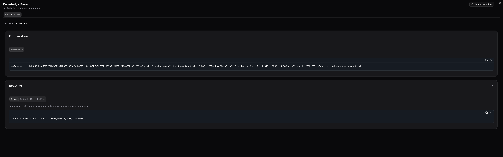

# Custom Data & Templates

RAPTR can import templates, knowledge base articles, and report templates from your organization's custom data repository. This allows you to maintain a private library of standardized content tailored to your engagement methodology.

## Overview

Custom data is imported via the **Seed Custom Data** button in the [admin panel](../user-guide/administration.md#custom-data). RAPTR downloads a ZIP file from the configured URL and imports its contents.

For an overview of the available templates see [Templates](../user-guide/templates.md).

### Import Behavior

Each data type has different import behavior during seeding see [administration](../user-guide/administration.md#custom-data).

## Configuration

Set these environment variables in your `.env` file:

| Variable | Required | Description |
|---|---|---|
| `CUSTOM_DATA_URL` | Yes | URL to your repository ZIP file |
| `CUSTOM_DATA_TOKEN` | No | Bearer token for private repositories (e.g., GitHub PAT) |


### Repository Examples

**Public GitHub repository:**

```env
CUSTOM_DATA_URL=https://api.github.com/repos/{owner}/{repo}/zipball/{branch}
```

**Private GitHub repository (requires a GitHub Personal Access Token):**

```env
CUSTOM_DATA_URL=https://api.github.com/repos/{owner}/{repo}/zipball/{branch}
CUSTOM_DATA_TOKEN=ghp_your_personal_access_token
```

**Private GitLab repository (requires a GitLab Personal Access Token or Project Access Token):**

```env
CUSTOM_DATA_URL=https://gitlab.com/api/v4/projects/{project_id}/repository/archive.zip
CUSTOM_DATA_TOKEN=your_gitlab_personal_access_token
```

## Repository Structure

The ZIP file must contain a `templates/` directory with the following subdirectories:

```
templates/
├── activities/          # Activity template YAML files
│   ├── kerberoasting.yaml
│   └── as-rep.yaml
├── groups/              # Activity group template YAML files
│   ├── kerberoasting.yaml
│   └── initial_access.yaml
├── campaigns/           # Campaign template YAML files
│   └── standard.yaml
├── kb/                  # Knowledge base article YAML files
│   ├── kerberoasting.yaml
│   └── phishing_guide.yaml
├── evaluation/          # Evaluation template YAML files
│   ├── sla_check.yaml
│   └── other_issues.yaml
└── report/              # Report template files (.html or .docx)
    ├── executive_summary.docx
    └── falt_report.html
```

??? tip "GitHub ZIP structure"
    When downloading a GitHub repository as a ZIP, the contents are wrapped in a top-level directory (e.g., `raptr-templates-main/`). RAPTR handles this automatically — it scans for `templates/` at any depth.

## Template Formats

### Activity Templates

**Directory**: `templates/activities/`
**Format**: YAML (`.yaml`)

Each YAML file defines one activity template using **camelCase** field names:

```yaml
name: "Kerberoasting"
mitreTactic: TA0006
mitreTechnique: T1558.003
priority: "High"
activityRationale: Adversaries may request a ticket-granting service (TGS) ticket, which is
  encrypted using a weak algorithm, such as RC4. These tickets can be attacked with
  an offline brute force attack.
activityRequirements: "Accounts with a configured Service Principal Name (SPN)."
activityActions: ""
activityNotes: ""
expectedseverity: "High"
expectedLogging: true
expectedPrevention: false
expectedAlertCreation: true
expectedStakeholderNotification: false
provider: "compass"
kbArticles:
  - "kerberoasting"
```

#### Field Reference

| YAML Field | Type | Required | Default | Description |
|---|---|---|---|---|
| `name` | string | Yes | — | Activity template name |
| `mitreTactic` | string | Yes | — | MITRE ATT&CK tactic ID (e.g., "TA0006") |
| `mitreTechnique` | string | Yes | — | MITRE technique ID (e.g., "T1558.003") |
| `priority` | string | No | `"Low"` | Activity priority: `Low`, `Medium`, `High`, `Critical` |
| `activityRationale` | string | No | `""` | Why this activity is tested. Supports Markdown |
| `activityRequirements` | string | No | `""` | Environmental prerequisites. Supports Markdown |
| `activityActions` | string | No | `""` | Step-by-step execution instructions. Supports Markdown |
| `activityNotes` | string | No | `""` | Additional notes. Supports Markdown |
| `expectedLogging` | boolean | No | `false` | Whether logging is expected |
| `expectedPrevention` | boolean | No | `false` | Whether prevention is expected |
| `expectedAlertCreation` | boolean | No | `false` | Whether an alert is expected |
| `expectedStakeholderNotification` | boolean | No | `false` | Whether a stakeholder notification is expected |
| `expectedseverity` | string | No | `"Low"` | Expected severity: `Informational`, `Low`, `Medium`, `High`, `Critical` |
| `provider` | string | No | `"Custom"` | Template source identifier. Must not be `"ART"` (reserved for Atomic Red Team) |
| `kbArticles` | list | No | `[]` | List of knowledge base article names to link |

### Activity Group Templates

**Directory**: `templates/groups/`
**Format**: YAML (`.yaml`)

Groups reference activity templates by **exact name**:

```yaml
name: 'Kerberoasting'
description: 'Activities focused on Kerberoasting'
activities:
  - 'Enumerate Kerberoastable Accounts'
  - 'Kerberoasting'
```

#### Field Reference

| YAML Field | Type | Required | Description |
|---|---|---|---|
| `name` | string | Yes | Unique group name |
| `description` | string | No | Group description |
| `activities` | list | No | Ordered list of activity template names. Position is determined by array order |

??? warning "Name matching"
    Activity names must exactly match existing activity templates. Unmatched names are logged as warnings and skipped.

    This also applies to `kbArticles` names.


### Campaign Templates

**Directory**: `templates/campaigns/`
**Format**: YAML (`.yaml`)

Campaigns reference both activity and group templates:

```yaml
name: 'Standard AD Campaign'
description: 'Standard Active Directory assessment campaign'
items:
  - type: group
    ref: 'AS-Rep'
  - type: group
    ref: 'Kerberoasting'
  - type: activity
    ref: 'DCSync'
  - type: activity
    ref: 'Golden Ticket Usage'

```

#### Field Reference

| YAML Field | Type | Required | Description |
|---|---|---|---|
| `name` | string | Yes | Unique campaign name |
| `description` | string | No | Campaign description |
| `items` | list | No | Ordered list of campaign items |

Each item in the `items` array:

| Field | Type | Required | Values | Description |
|---|---|---|---|---|
| `type` | string | Yes | `"group"` or `"activity"` | What kind of template to reference |
| `ref` | string | Yes | Template name | Exact name of the activity or group template |

??? warning "Name matching"
    Activity and activity group names must exactly match existing templates. Unmatched names are logged as warnings and skipped.

### Knowledge Base Articles

**Directory**: `templates/kb/`
**Format**: YAML (`.yaml`)

Knowledge base articles are designed to provide the Red Team with quick access on different execution methods for the given activity. KB articiles are automatically linked by the MITRE Technique ID. You can link other KB articles in the activity templates using the `kbArticles` field. See [Activity Templates](#activity-templates).

```yaml
name: "Kerberoasting"
mitre_technique_id: "T1558.003"
sections:
- title: "Enumeration"
  tabs:
  - title: "pyldapsearch"
    content: |
      ```
      pyldapsearch '{{DOMAIN_NAME}}/{{LOWPRIVILEGED_DOMAIN_USER}}:{{LOWPRIVILEGED_DOMAIN_USER_PASSWORD}}' "(&(&(servicePrincipalName=*)(UserAccountControl:1.2.840.113556.1.4.803:=512))(!(UserAccountControl:1.2.840.113556.1.4.803:=2)))" -dc-ip {{DC_IP}} -ldaps -output users_kerberoast.txt
      ```
- title: "Roasting"
  tabs:
  - title: "Rubeus"
    content: |
      Rubeus does not support roasting based on a list. You can roast single users:
      ```
      rubeus.exe kerberoast /user:{{TARGET_DOMAIN_USER}} /simple
      ```
  - title: "GetUserSPNS.py"
    content: |
      userfile option requires one username per line (just the username, no domain needed).
      ```
      GetUserSPNs.py -request -outputfile kerberoastables.txt -dc-ip {{DC_IP}} -usersfile {{TARGET_FILE_NAME}} '{{DOMAIN_NAME}}/{{LOWPRIVILEGED_DOMAIN_USER}}:{{LOWPRIVILEGED_DOMAIN_USER_PASSWORD}}'
      ```
  - title: "NetExec"
    content: |
      This will enumerate the accounts again!
      ```
      nxc ldap {{DC_IP}} -u {{LOWPRIVILEGED_DOMAIN_USER}} -p {{LOWPRIVILEGED_DOMAIN_USER_PASSWORD}} --kerberoasting output.txt
      ```
```

#### Field Reference

| YAML Field | Type | Required | Description |
|---|---|---|---|
| `name` | string | Yes | Unique article name, used to link in activity templates `kbArticles` field |
| `mitre_technique_id` | string | No | MITRE technique ID for automatic linking (e.g., "T1558.003") |
| `sections` | list | No | List of sections |
| `sections.title` | string | Yes | Section title, will be rendered as a collapsible header |
| `sections.tabs` | list | No | List of tabs in the collapsible section |
| `sections.tabs.title` | string | Yes | Tab title |
| `sections.tabs.content` | string | Yes | Tab content, will be rendered as a code block |


??? abstract "Rendered Kerberoasting Example"
    [](../assets/admin-example-kb-entry.png){:target="_blank"}

??? tip "Variables"
    Use `{{ VARIABLE_NAME }}` placeholders in code blocks. Users can import a variables JSON file to replace these placeholders with environment-specific values. See [Knowledge Base](../user-guide/knowledge_base.md#variables).


### Evaluation Templates

**Directory**: `templates/evaluation/`
**Format**: YAML (`.yaml`)

```yaml
name: "SLA Compliance"
evaluationCriteria: "Was the alert triaged within the defined SLA?"
description: "Check whether the SOC responded within the contractual SLA window."
```

#### Field Reference

| YAML Field | Type | Required | Description |
|---|---|---|---|
| `name` | string | Yes | Unique template name (used for matching on update) |
| `evaluationCriteria` | string | Yes | The evaluation question |
| `description` | string | No | Additional context for the question |

### Report Templates

**Directory**: `templates/report/`
**Formats**: `.html` or `.docx`

Report template files are stored as-is (binary). No YAML wrapper is needed — just place the template files directly in the directory.

```
templates/report/
├── executive_summary.docx
├── detailed_assessment.docx
└── flat_report.html
```

For details on creating report templates, see [Report Templates](report_templates.md).

## Import Order

Templates are imported in dependency order:

1. **Knowledge base articles** — imported first so activities can reference them
2. **Activity templates** — imported second
3. **Activity group templates** — imported third (references activities by name)
4. **Campaign templates** — imported fourth (references activities and groups by name)
5. **Evaluation templates** — independent, updated in place
6. **Report templates** — independent, fully replaced

## Import Response

After seeding, RAPTR returns a summary showing success and failure counts for each template type:

```
Import completed. Knowledge Base: 15 success, 0 failed. Activities: 42 success, 2 failed.
Groups: 8 success, 0 failed. Campaigns: 3 success, 0 failed. Evaluations: 5 success, 0 failed.
Report Templates: 2 success, 0 failed.
```

Failed items are logged with details in the application logs (check `docker logs`).
