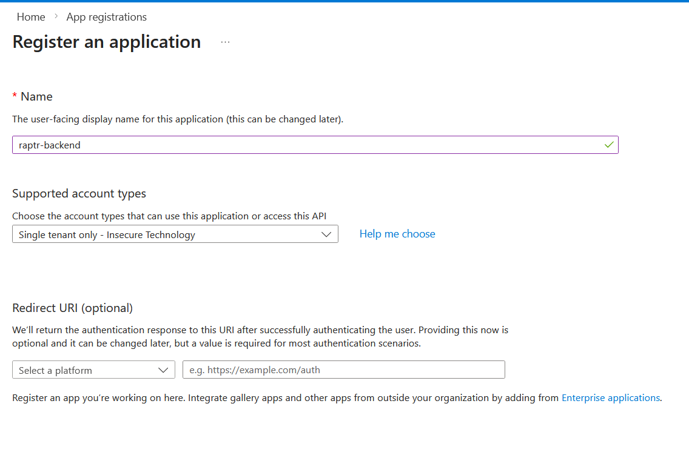
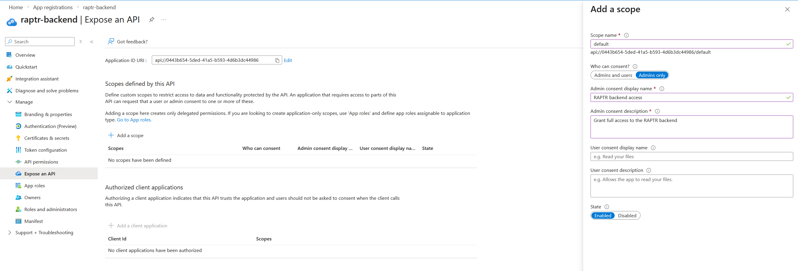
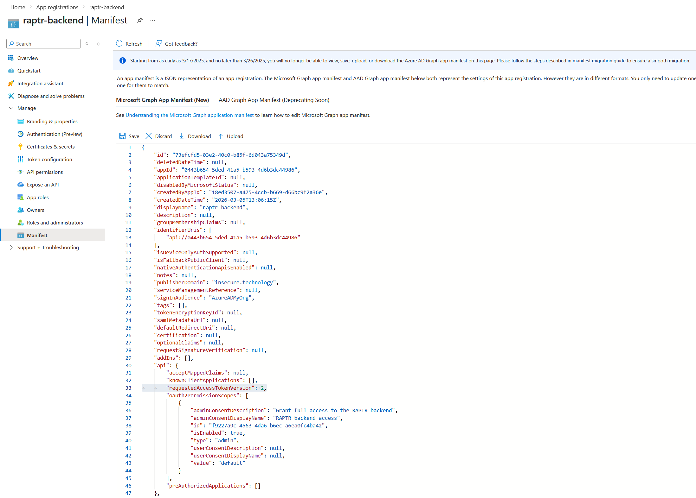
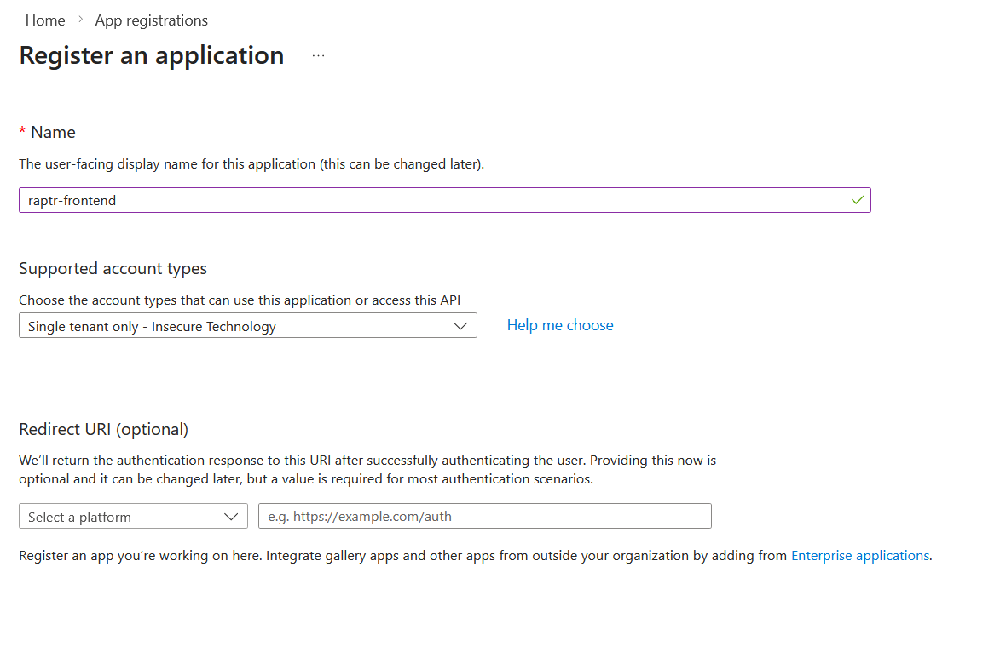
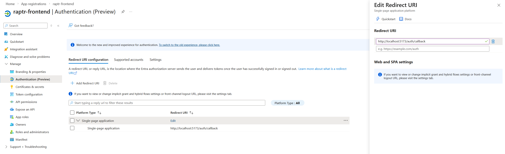
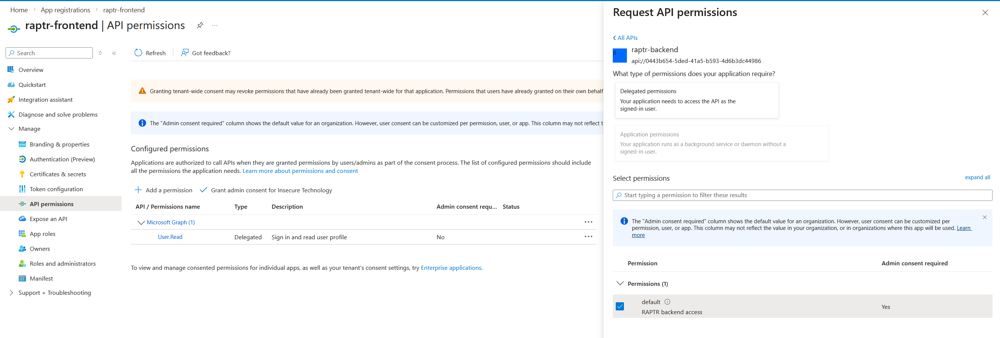

# External Authentication

RAPTR supports external OAuth 2.0 / OpenID Connect (OIDC) identity providers alongside its built-in local authentication. This allows users to sign in with their organization's existing identity provider (e.g., Microsoft Entra ID, Okta, Keycloak).

## How It Works

1. The frontend gets the list of available providers from the `/auth/providers` endpoint
2. The frontend redirects the user to the configured identity provider for login
3. The IDP authenticates the user and returns a JWT access token
4. RAPTR validates the token using the provider's JWKS (JSON Web Key Set) endpoint
5. RAPTR validates the existence of the user in the database
6. If the token is valid and the user's email domain is trusted for this provider, access is granted

??? tip "Enforce MFA for external users"
    It is assumed that MFA is enforced at the identity provider level. Nevertheless, you have the option to enable additional MFA for external users by setting the `OTP_EXTERNAL_ENABLED` in your `.env` file to `true`. See [configuration](configuration.md#security)

??? bug "No external MFA claim validation"
    RAPTR does not validate the presence of an MFA claim in the external IDP JWT.

## Configuration

External providers are configured via the `EXTERNAL_AUTH_CONFIGS` environment variable in your `.env` file. The value is a **JSON array** of provider objects.

### Provider Fields

| Field | Type | Required | Description |
|---|---|---|---|
| `name` | string | Yes | Display name shown on the login page (e.g., "Entra ID", "Okta") |
| `configuration` | string | Yes | The IDP's .well-known/openid-configuration URL |
| `issuer` | string | Yes | OIDC issuer URL. Must match the `iss` claim in the JWT |
| `jwks_url` | string | Yes | URL to the provider's JWKS endpoint for token signature verification |
| `audience` | string | Yes | Expected `aud` claim in the JWT. Either a dedicated client ID for your backend or the OAuth client ID |
| `client_id` | string | Yes | OAuth 2.0 client ID registered with the provider |
| `scope` | string | Yes | OAuth scopes to request (e.g., `openid profile email`) |
| `username_claim` | string | Yes | JWT claim to match the external user against the user in the RAPTR database |
| `trusted_email_domains` | list | Yes | List of allowed email domains for which the IDP is allowed to issue JWT |

### Frontend Implementation

Since the frontend application is a Single Page Application (SPA) and cannot securely store a `client_secret`, it acts as a public client. Therefore, the implementation uses the **Authorization Code Flow**.

To ensure a secure token exchange without a client secret, **Proof Key for Code Exchange (PKCE) is strictly enforced** by the frontend. When configuring your external Identity Provider, ensure the client is set up as a public client (e.g., "Single-page application" platform type) that supports the Authorization Code Flow with PKCE and does not require a client secret.

## No Auto-Provisioning

When a user logs in via an external provider a corresponding user must already exist in the database. The user is then authenticated using the external provider's JWT. See [administration](../user-guide/administration.md#creating-a-user) to create users.


??? bug "Last login time"
    When a user logs in via an external provider, the `last_login_at` timestamp is **not** updated. This field is only updated for local (password-based) authentication.


### Example Entra ID Setup Steps

In this example setup we show you how to configure Entra ID as an external authentication provider for RAPTR.

For this purpose we will create two application registrations in Entra ID:

1. The backend application registration exposing an "API" which can be used as `scope` and `audience`
2. The frontend application registration which is used by the SPA to authenticate against Entra ID

??? info "Entra Access Token Version"
    The `AccessTokenVersion` must be set to `2` for the backend application registration.

#### Register the backend as an application in Entra ID

1. In the Entra Portal create a new Application Registration for the backend
[](../assets/admin-configure-external-idp-backend-app-registration.png){:target="_blank"}

2. Configure an API exposure for the backend application registration
[](../assets/admin-configure-external-idp-backend-expose-api.png){:target="_blank"}

3. Configure the `AccessTokenVersion` to `2`
[](../assets/admin-configure-external-idp-backend-access-token-version.png){:target="_blank"}

4. Note down the following values:
    - Application (client) ID of the backend application registration (e.g. `0443b654-5ded-41a5-b593-4d6b3dc44986`)
    - The defined API scope from step 2. (e.g. `api://0443b654-5ded-41a5-b593-4d6b3dc44986/default`)

#### Register the frontend as an application in Entra ID

1. In the Entra Portal create a new Application Registration for the frontend
[](../assets/admin-configure-external-idp-frontend-app-registration.png){:target="_blank"}

2. Configure valid SPA Redirect URI - The frontend calls `/auth/callback`
[](../assets/admin-configure-external-idp-frontend-redirect-uri.png){:target="_blank"}

3. Grant API access to the backend API - You might need to consent tenant wide with an admin account
[](../assets/admin-configure-external-idp-frontend-grant-backend-api-permission.png){:target="_blank"}

4. Note down the following values:
    - Application (client) ID of the frontend application registration (e.g. `800fb3d6-112c-4231-bbd7-cf2d90ab516c`)
    - Your tenant ID (e.g. `925c2cd8-a177-41a5-93f3-1257ffd75334`)

#### Example Entra ID Configuration

Now lets bring everything together for the RAPTR configuration:

```env
EXTERNAL_AUTH_CONFIGS='[
  {
    "name": "Entra ID",
    "configuration": "https://login.microsoftonline.com/{tenant-id}/v2.0/.well-known/openid-configuration",
    "issuer": "https://login.microsoftonline.com/{tenant-id}/v2.0",
    "jwks_url": "https://login.microsoftonline.com/{tenant-id}/discovery/v2.0/keys",
    "audience": "{your-backend-app-client-id}",
    "scope": "api://{your-backend-app-client-id}/default",
    "client_id": "{your-frontend-app-client-id}",
    "username_claim": "preferred_username",
    "trusted_email_domains": [
      "{your-org.something}"
    ]
  }
]'
```

??? abstract "Config example with values from the setup"

    ```env
    EXTERNAL_AUTH_CONFIGS='[
      {
        "name": "Entra ID",
        "configuration": "https://login.microsoftonline.com/925c2cd8-a177-41a5-93f3-1257ffd75334/v2.0/.well-known/openid-configuration",
        "issuer": "https://login.microsoftonline.com/925c2cd8-a177-41a5-93f3-1257ffd75334/v2.0",
        "jwks_url": "https://login.microsoftonline.com/925c2cd8-a177-41a5-93f3-1257ffd75334/discovery/v2.0/keys",
        "audience": "0443b654-5ded-41a5-b593-4d6b3dc44986",
        "scope": "api://0443b654-5ded-41a5-b593-4d6b3dc44986/default",
        "client_id": "800fb3d6-112c-4231-bbd7-cf2d90ab516c",
        "username_claim": "preferred_username",
        "trusted_email_domains": [
          "insecure.technology"
        ]
      }
    ]'
    ```

??? tip "Multiple Providers"

    You can configure multiple providers by adding more objects to the JSON array. Each provider will appear as a separate login option on the login page.

    ```env
    EXTERNAL_AUTH_CONFIGS='[
      {
        "name": "Entra ID",
        "configuration": "entra",
        "issuer": "https://login.microsoftonline.com/TENANT_A/v2.0",
        "jwks_url": "https://login.microsoftonline.com/TENANT_A/discovery/v2.0/keys",
        "audience": "CLIENT_ID_A",
        "client_id": "CLIENT_ID_A",
        "scope": "openid profile email",
        "username_claim": "email",
        "trusted_email_domains": ["company-a.com"]
      },
      {
        "name": "Okta",
        "configuration": "okta",
        "issuer": "https://company-b.okta.com",
        "jwks_url": "https://company-b.okta.com/oauth2/v1/keys",
        "audience": "CLIENT_ID_B",
        "client_id": "CLIENT_ID_B",
        "scope": "openid profile email",
        "username_claim": "email",
        "trusted_email_domains": ["company-b.com"]
      }
    ]'
    ```

??? bug "Logout time and `iat` in Entra Tokens"
    For whatever reason, Microsoft issues tokens with an `iat` time that is several minutes in the past. This interferes with the token invalidation process in RAPTR. When a user logs out, the time at which they logged out is written to the database. Every JWT must be issued before that timestamp. However, since Microsoft issues an `iat` time from the past, a user who logs out and logs in directly again will receive a new JWT, but the `iat` time will still be older than the logout timestamp. Consequently, the token will be deemed invalid.


