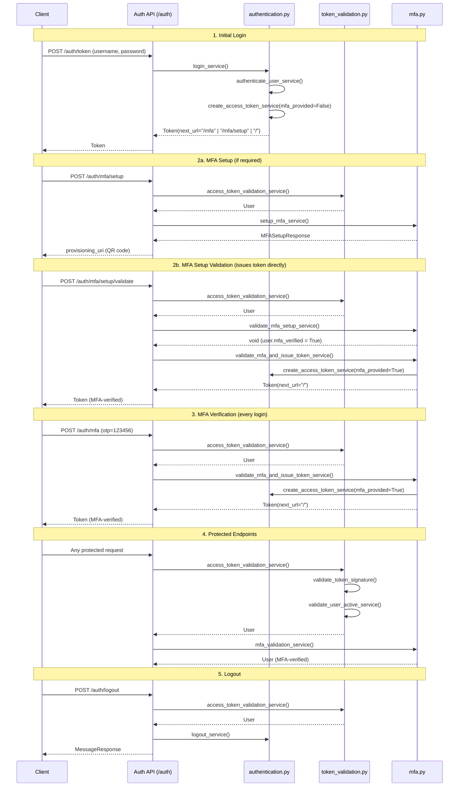

# Authentication & Authorization

The backend uses a layered authentication and authorization system built on FastAPI dependencies. Each layer builds on the previous one, forming a dependency chain.

## Login & MFA Flow



## Authentication Dependency Flow

```
Request with Bearer token
    │
    ▼
access_token_validation_service     ← Decode JWT, validate signature, load User from DB
    │
    ▼
mfa_validation_service              ← Check MFA claim in JWT (if MFA is enabled)
    │
    ▼
Authorization dependency            ← Role / ACL checks (varies per endpoint)
    │
    ▼
Route handler receives User object
```

**Step 1 — Token validation** (`app/core/token_validation.py`): Extracts the `iss` (issuer) claim from the JWT to determine the validation strategy. Internal tokens (issued by the app) are verified with HMAC. External tokens (OIDC providers) are verified against the provider's JWKS endpoint. After signature validation, the user is loaded from the database and checked for existence and active status. Tokens issued before a user's `last_logout_at` are rejected.

**Step 2 — MFA validation** (`app/core/mfa.py`): If MFA is enabled (via `OTP_LOCAL_ENABLED` or `OTP_EXTERNAL_ENABLED`), verifies that the JWT contains `mfa_provided: true`. Users without MFA setup are directed to the setup endpoint.

**Step 3 — Authorization** (`app/core/authorization.py`): Enforces role-based or ACL-based access. This is where the four authorization dependencies come in.

## Authorization Dependencies

All authorization logic lives in `app/core/authorization.py`. There are four dependencies, each suited to a different access pattern:

| Dependency | Use case | Minimum role |
|-----------|----------|-------------|
| `mfa_validation_service` | Any authenticated user | — (logged in) |
| `admin_role_validation_service` | Admin-only operations | `UserRole.ADMIN` |
| `require_assessment_role(AclRole.X)` | Assessment-scoped access | Specified ACL role |
| `validate_activity_update_permission` | Activity update with Blue team restrictions | `AclRole.BLUE` |

### 1. Authenticated User — `mfa_validation_service`

Use this when any logged-in user should have access. This is the base dependency for all protected endpoints.

```python
from app.core.mfa import mfa_validation_service

@router.get("/me", response_model=UserRead)
def read_user_self(
    user: User = Depends(mfa_validation_service),
    session: Session = Depends(get_session),
):
    return user
```

### 2. Admin Only — `admin_role_validation_service`

Use this for system-wide admin operations (user management, creating assessments, etc.). Checks that `user.role == UserRole.ADMIN`.

```python
from app.core.authorization import admin_role_validation_service

@router.post("/", response_model=AssessmentRead)
def create_assessment(
    assessment: AssessmentBase,
    user: User = Depends(admin_role_validation_service),
    session: Session = Depends(get_session),
):
    return create_assessment_service(assessment, user, session)
```

### 3. Assessment Role — `require_assessment_role()`

This is a **dependency factory** — call it with the minimum required `AclRole` and it returns a dependency. Use this for any endpoint scoped to a specific assessment.

The ACL role hierarchy is: `spectator (0) < blue (1) < red (2)`. A user with `red` access passes checks that require `blue` or `spectator`.

```python
from app.core.authorization import require_assessment_role
from app.enums.enums import AclRole

# Read-only: any assessment member can access
@router.get("/", response_model=PaginatedResponse[ActivityRead])
def get_all_activities(
    assessment_id: uuid.UUID,
    filter_query: Annotated[ActivityFilter, Query()],
    user: User = Depends(require_assessment_role(AclRole.SPECTATOR)),
    session: Session = Depends(get_session),
):
    return get_all_activities_service(assessment_id, user, session, filter_query)

# Write operation: requires red team access
@router.post("/", response_model=ActivityGroupRead)
def create_activity_group(
    activity_group: ActivityGroupBase,
    assessment_id: uuid.UUID,
    user: User = Depends(require_assessment_role(AclRole.RED)),
    session: Session = Depends(get_session),
):
    return create_activity_group_service(activity_group, assessment_id, user, session)
```

**How it works internally:**

1. Verifies the assessment exists and the user can see it
2. Admins bypass ACL checks and are treated as `AclRole.RED`
3. Looks up the user's `Acl` entry for that assessment
4. Compares the user's role against the required role using the hierarchy
5. Attaches the user's ACL role to the `User` object as `user.assessment_acl_role`

### 4. Activity Update Permission — `validate_activity_update_permission`

A specialized dependency for activity updates that applies Blue team restrictions. Red team and admins have full access; Blue team members can only update activities that are visible, not deleted, and in `Waiting Red` or `Waiting Blue` state.

```python
from app.core.authorization import validate_activity_update_permission

@router.put("/{activity_id}", response_model=ActivityRead)
def update_activity(
    activity_id: uuid.UUID,
    activity: ActivityUpdate,
    assessment_id: uuid.UUID,
    user: User = Depends(validate_activity_update_permission),
    session: Session = Depends(get_session),
):
    return update_activity_service(activity_id, activity, assessment_id, user, session)
```

## The User Object with ACL Role

When `require_assessment_role()` or `validate_activity_update_permission` is used, the dependency attaches the user's assessment-specific ACL role to the `User` object:

```python
user.assessment_acl_role  # → AclRole.RED, AclRole.BLUE, or AclRole.SPECTATOR
```

This allows the service layer to make role-aware decisions without querying the ACL table again:

```python
def update_activity_service(
    activity_id: uuid.UUID,
    activity: ActivityUpdate,
    assessment_id: uuid.UUID,
    user: User,
    session: Session,
):
    # Use the ACL role attached by the authorization dependency
    if user.assessment_acl_role == AclRole.BLUE:
        # Blue team can only update certain fields
        ...
    else:
        # Red team / admin: full update
        ...
```

**Note:** `assessment_acl_role` is a runtime attribute — it does not exist on the `User` model as a database column. It is set dynamically by the authorization dependency and is only available in request handlers that use an assessment-scoped auth dependency.

## ACL Model

The `Acl` model (`app/models/acl.py`) stores per-assessment role assignments:

```python
class Acl(Base):
    id: Mapped[uuid.UUID]
    user_id: Mapped[uuid.UUID]          # FK → User
    assessment_id: Mapped[uuid.UUID]    # FK → Assessment
    assessment_role: Mapped[AclRole]    # red, blue, or spectator
```

Each user can have exactly one role per assessment (enforced by a unique constraint on `user_id + assessment_id`).

## Choosing the Right Dependency

| Scenario | Dependency |
|---------|-----------|
| Any logged-in user (e.g., list own assessments, profile) | `mfa_validation_service` |
| System admin operations (create assessment, manage users) | `admin_role_validation_service` |
| Read assessment data (any team member can view) | `require_assessment_role(AclRole.SPECTATOR)` |
| Blue team operations within an assessment | `require_assessment_role(AclRole.BLUE)` |
| Red team / write operations within an assessment | `require_assessment_role(AclRole.RED)` |
| Activity updates with Blue team field restrictions | `validate_activity_update_permission` |
