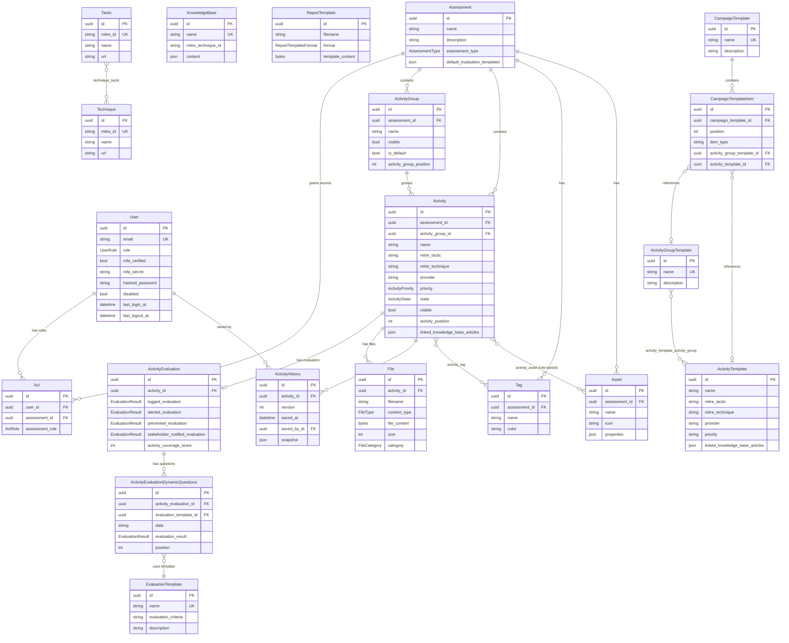

# Database & Testing

## Database

- **Production**: PostgreSQL (configured via `POSTGRES_*` env vars)
- **Development or small environments**: SQLite is supported (`DB_ENGINE=sqlite`)
- **ORM**: SQLAlchemy 2.0 with modern `Mapped` type annotations

### Schema Generation (No Migrations)

The project currently **does not use Alembic** or any migration tool. 

The database schema is automatically generated on application startup. In `app/core/startup.py`, the backend inspects all modules that inherit from `Base` and ensures the database tables exist:

```python
Base.metadata.create_all(bind=engine)
```

Because of this, destructive changes (like dropping a column or renaming a table) require manual database intervention if applied to an existing production database.

### Session Management

Database sessions are managed via FastAPI's dependency injection system, ensuring a session is opened when a request begins and closed when it finishes. Always inject `Session = Depends(get_session)` into your routers, and explicitly pass it down to your services.

```python
from app.db.session import get_session

@router.get("/")
def my_endpoint(session: Session = Depends(get_session)):
    return my_service(session)
```

## Database Schema

Entity-relationship diagram of all SQLAlchemy models in `app/models/`. The diagram is split into three sections: **Core** (assessment workflow), **Templates** (reusable configuration), and **Reference Data** (MITRE ATT&CK).

All models inherit from `Base`, which provides audit fields (`created_by`, `created_at`, `updated_by`, `updated_at`) — these are omitted from the diagram for clarity.  Models using `SoftDeleteMixin` also have `deleted`, `deleted_at`, and `deleted_by` fields.



## Association Tables

The following join tables implement many-to-many relationships:

| Table | Links | Extra columns |
|-------|-------|---------------|
| `activity_tag` | Activity ↔ Tag | — |
| `activity_asset` | Activity ↔ Asset | `role` (source, target, tool, log_source, prevention_source, alert_source, stakeholder_notification_source) |
| `technique_tactic` | Technique ↔ Tactic | — |
| `activity_template_activity_group` | ActivityTemplate ↔ ActivityGroupTemplate | `position` |

## Mixins

| Mixin | Used by | Fields added |
|-------|---------|-------------|
| `SoftDeleteMixin` | Activity, ActivityGroup, Tag, Asset | `deleted`, `deleted_at`, `deleted_by` |

## Testing

The backend test suite runs against an isolated, in-memory SQLite database (`sqlite://`), completely separate from your development or production data.

```bash
uv run pytest              # Run all tests
uv run pytest tests/test_assessment.py  # Run specific test file
uv run pytest -v           # Verbose output
```

??? bug "AI Slop"
    Full transparency: All, I mean ALL, tests are AI generated. Without AI, there would probably be no tests, since I couldn't be bothered with writing tests. The effectiveness and coverage of these tests must be proven in the future.

### Pytest Fixtures

The test environment provides several crucial fixtures automatically (defined in `tests/conftest.py`):

- **`session`**: Provides an active SQLAlchemy session connected to the empty in-memory test database. Use this to seed test data or query results directly.
- **`client`**: A `TestClient` instance that has its `get_session` dependency overridden to use the test database above.
- **Auth Fixtures**: Pre-built users (`test_admin_user`, `test_regular_user`, `test_disabled_user`) and their corresponding ready-to-use API headers (`auth_headers_admin`, `auth_headers_regular`).

**Example Test:**
```python
def test_create_widget(client: TestClient, auth_headers_admin: dict):
    response = client.post(
        "/api/v1/widgets/",
        json={"name": "Test Widget"},
        headers=auth_headers_admin
    )
    assert response.status_code == 200
```

## Linting and Formatting

We use [Ruff](https://docs.astral.sh/ruff/) for both linting and formatting:

```bash
uv run ruff check .        # Lint (errors, pyflakes, import sorting)
uv run ruff check --fix .  # Lint with auto-fix
uv run ruff format .       # Format code
uv run ruff format --check .  # Check formatting without changes
```

Ruff configuration in `pyproject.toml`:

```toml
[tool.ruff.lint]
select = ["E", "F", "I"]   # Error, Pyflakes, isort
ignore = ["E501"]           # Line length not enforced
```

All linting and format checks run automatically in CI on pull requests.
