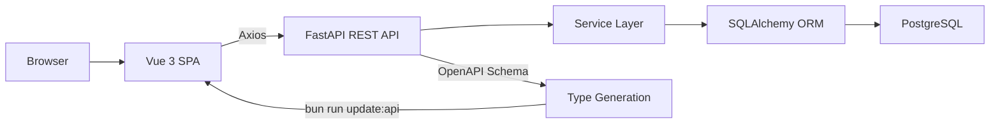

# Developer Guide

Welcome to the Developer Guide! This section is for engineers who want to understand the inner workings of RAPTR or contribute to the codebase.

## Architecture Overview

RAPTR is a decoupled web application with a Python backend serving a Vue 3 single-page application. In production, everything runs as a single Docker container.



The frontend and backend are deliberately developed as decoupled, separate entities. Because the frontend ecosystem evolves rapidly, building the frontend as an independent SPA ensures it is fully replaceable. The backend API is designed to be the stable, long-term core of the project. Whatever framework is popular in the future can replace the current frontend without requiring any breaking changes to the backend.

### How the Pieces Fit Together

| Layer | Technology | Role |
|-------|-----------|------|
| **Frontend** | Vue 3, Vite, TailwindCSS, Pinia | Reactive SPA with type-safe API integration |
| **API** | FastAPI, Pydantic | REST endpoints with automatic OpenAPI docs |
| **Business Logic** | Service layer | Domain logic separated from HTTP concerns |
| **Data** | SQLAlchemy 2.0, PostgreSQL | ORM with `Mapped` type annotations |
| **Auth** | JWT + optional OIDC | Local auth with external IdP support |

### Backend Architecture

The backend follows a layered pattern where each layer has a clear responsibility:

```
Routers (app/api/v1/)       → HTTP request/response handling
    ↓
Schemas (app/schemas/)      → Pydantic validation and serialization
    ↓
Services (app/services/)    → Business logic and orchestration
    ↓
Models (app/models/)        → SQLAlchemy ORM entities
```

Routers never contain business logic — they validate input, call services, and return responses. Services operate on models and return schema-typed results.

### Frontend Architecture

The frontend mirrors the backend's separation of concerns:

```
Views (src/views/)          → Page-level components bound to routes
    ↓
Stores (src/stores/)        → Pinia state management (no direct API calls)
    ↓
Services (src/services/)    → Axios-based API communication
    ↓
Types (src/types/)          → Auto-generated from backend OpenAPI schema
```

Stores manage reactive state but **delegate all API calls to services**. Types are generated directly from the backend's OpenAPI schema, ensuring the frontend and backend always agree on data shapes.

### Frontend ↔ Backend Contract

The OpenAPI schema is the contract between frontend and backend. Code generation is handled by [`@hey-api/openapi-ts`](https://heyapi.dev/), configured in `frontend/openapi-ts.config.ts`. After any backend API change:

```bash
bun run update:api   # Fetches OpenAPI schema and regenerates TypeScript types + Zod schemas (requires running backend service at localhost:8000)
```

This generates `src/types/types.gen.ts` (TypeScript types) and `src/types/zod.gen.ts` (Zod validation schemas) from the running backend. Forms validate against the generated `z<SchemaName>` exports through a small Zod v4 adapter at `src/utils/zodAdapter.ts`.

### Docker Build

Production uses a multi-stage Docker build:

1. **Stage 1** — Bun builds the Vue frontend into static assets
2. **Stage 2** — Python serves everything: FastAPI for the API, static file serving for the SPA

The result is a single container exposing port 8000, with optional TLS support.

## Design Principles

- **Service layer separation** — Business logic lives in services, not in routers or stores
- **Type safety end-to-end** — Python type hints, Pydantic schemas, auto-generated TypeScript types
- **Explicit over implicit** — Prefer readable, straightforward code over clever abstractions
- **Single source of truth** — OpenAPI schema defines the API contract; types are generated, not hand-written

## Next Steps

- **[Backend Development](backend/index.md)** — Project structure, dev setup, adding endpoints
- **[Frontend Development](frontend.md)** — Project structure, dev setup, key patterns
- **[Contributing](contributing.md)** — How to submit changes
- **[Issues & Requests](issues.md)** — Reporting bugs, requesting features
