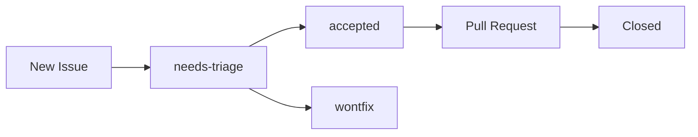

# Issues & Requests

We use [GitHub Issues](https://github.com/CompassSecurity/raptr/issues) to track bugs, feature requests, and documentation improvements. This page explains how to file issues and how they are managed.

## Reporting a Bug

Use the **Bug Report** issue template. Include:

- **Description** — What went wrong?
- **Steps to reproduce** — Minimal steps to trigger the bug
- **Expected behavior** — What should have happened?
- **Actual behavior** — What happened instead?
- **Environment** — Browser, OS, RAPTR version, deployment method

A good bug report is specific and reproducible. Screenshots or error logs are always helpful.

## Requesting a Feature

Use the **Feature Request** issue template. Include:

- **Description** — What do you want?
- **Use case** — Why do you need this? What problem does it solve?
- **Proposed solution** — How do you think it should work? (optional)

Feature requests are triaged and prioritized by maintainers. Not all requests will be implemented, but all are considered.

## Reporting a Security Vulnerability

!!! warning
    Do **not** open a public issue for security vulnerabilities.

Use [GitHub Security Advisories](https://github.com/CompassSecurity/raptr/security/advisories/new) to report vulnerabilities privately. This ensures the issue can be addressed before public disclosure.

Include:

- **Description** — What is the vulnerability?
- **Impact** — What could an attacker do?
- **Steps to reproduce** — How to trigger it

## Labels

Issues are organized with labels to help with triage and filtering.

### Type Labels

| Label | Description |
|-------|-------------|
| `bug` | Something is broken |
| `feature` | New functionality request |
| `docs` | Documentation improvement |
| `security` | Security-related issue |

### Component Labels

| Label | Description |
|-------|-------------|
| `backend` | Affects the Python/FastAPI backend |
| `frontend` | Affects the Vue frontend |
| `deployment` | Affects Docker, CI/CD, or infrastructure |

### Priority Labels

| Label | Description |
|-------|-------------|
| `priority:high` | Needs prompt attention |
| `priority:low` | Nice to have, no rush |

### Status Labels

| Label | Description |
|-------|-------------|
| `needs-triage` | New issue, not yet reviewed |
| `accepted` | Triaged and accepted for work |
| `wontfix` | Decided not to address |

## Issue Lifecycle

1. New issues are automatically labeled `needs-triage`
2. A maintainer reviews and adds type, component, and priority labels
3. Accepted issues can be picked up by anyone (comment to claim)
4. The fixing PR should reference the issue (`Closes #42`)
5. Issue is closed when the PR is merged
