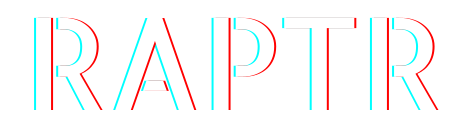
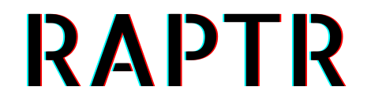
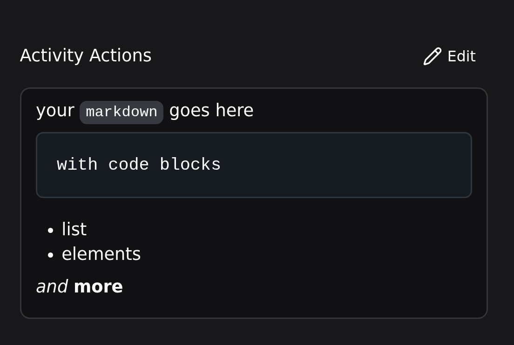
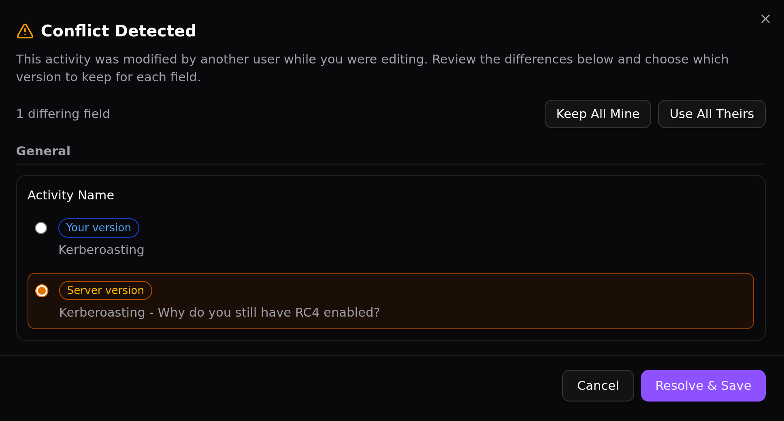
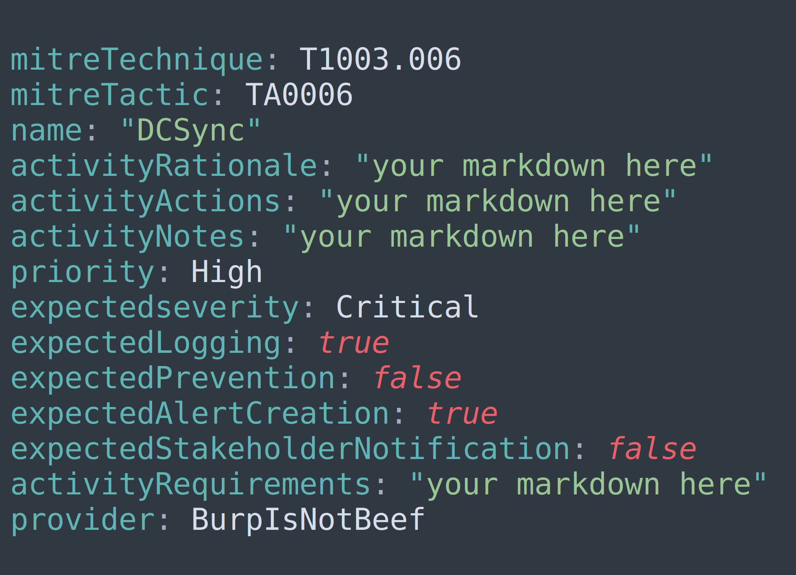

---
hide:
  - navigation
  - toc
---

# RAPTR

<!-- Hero -->

{ .light-only }
{ .dark-only }

# Security Assessment Management

Plan, document and evaluate Red Team and Purple Team assessments in one place. Open source, self-hosted and fully API driven.

[Open Demo :material-open-in-new:](https://sandbox.raptr.app){ .md-button .md-button--primary target="_blank" }
[Get Started](quick-start/index.md){ .md-button }

:material-language-python: FastAPI
:material-vuejs: Vue 3
:material-language-typescript: TypeScript
:material-docker: Docker
:material-database: PostgreSQL

<!-- Features Grid -->

## With :heart: for security teams

Everything you need to run a red or purple team assessment — from planning to final report.

:material-api:

### Full API Support
Built on FastAPI with auto-generated OpenAPI documentation. Every feature is accessible through the REST API.

:material-source-branch:

### Open Source
Extend, contribute, and enhance as you wish. RAPTR is fully open source — self-host it and adapt it to your organization's needs.

:material-account-switch:

### Bridge the Gap
Provide a shared workspace in which Red Teamers can document their expectations, precise timeline, and actions, while Blue Teamers simultaneously attach alerts, logs and detections.

:material-file-word-outline:

### Evaluate and Reporting
Define evaluation criteria to methodically assess results, then export them to JSON, or generate polished Word and HTML reports.

<!-- Deep Dive Features -->

## Built with collaboration in mind

One platform. Two teams. No silos.

### Markdown Support

For proper documentation, RAPTR supports Markdown formatting to style your activities with headers, code blocks, and lists. The editor even supports **copy-pasting images directly** — no uploads required.

[Learn more :material-arrow-right:](user-guide/activities#markdown-fields){ .md-button .md-button--primary }

{ loading=lazy }

{ loading=lazy }

### Built-in Conflict Resolution

Stop worrying about teammates overwriting your work. RAPTR tracks every change and **surfaces conflicts automatically**, letting you review and merge edits easily with a side-by-side diff view.

Every collaborative edit is managed safely so your assessment data is never lost in translation.

[Learn more :material-arrow-right:](user-guide/activities#conflict-resolution){ .md-button .md-button--primary }

### Template all the things

**Build a library** of reusable activity templates, group templates, full campaigns, knowledge base articles, and more to reuse across assessments.

Stop reinventing the wheel on every engagement. Centralize your Red Team tradecraft in structured YAML files and share it with your team.

[Learn more :material-arrow-right:](user-guide/templates){ .md-button .md-button--primary }

{ loading=lazy }

<!-- CTA -->

## Ready to get started?

Deploy RAPTR locally in under five minutes or dive into the documentation to learn more.

[Quick Start :material-arrow-right:](quick-start/index.md){ .md-button .md-button--primary }
[Admin Guide](admin-guide/index.md){ .md-button }
[Developer Guide](developer-guide/index.md){ .md-button }

