# Working with Activities

Activities are the core unit of work in RAPTR. This page covers everything you can do with activities and activity groups.

## Activity Table Views

RAPTR offers two ways to browse activities within an assessment:

- **Grouped view**: Activities are organized under their activity groups, with collapsible sections
- **Flat view**: All activities are displayed in a single list regardless of grouping

You can toggle between these views from the assessment toolbar. Both views support filtering by state, priority, visibility, and tags.

??? abstract "Activity table views"
    [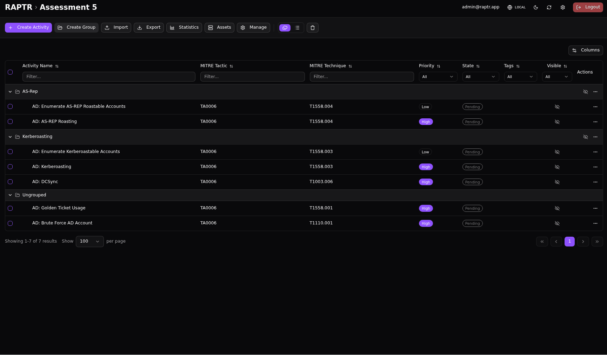](../assets/activity-view.gif){:target="_blank"}

??? tip "Add or remove columns"
    You can add or remove columns from the activity table by clicking the :lucide-settings-2: **Columns** button. This allows you to customize the view to your needs.

### Creating an Activity

1. Open an assessment
2. Click the **+ Create Activity** button
3. Provide a name and MITRE ATT&CK mapping (tactic and technique)
4. The activity is created in the **Pending** state

After creation, open the activity to fill in the remaining details.

??? abstract "Creating an activity"
    [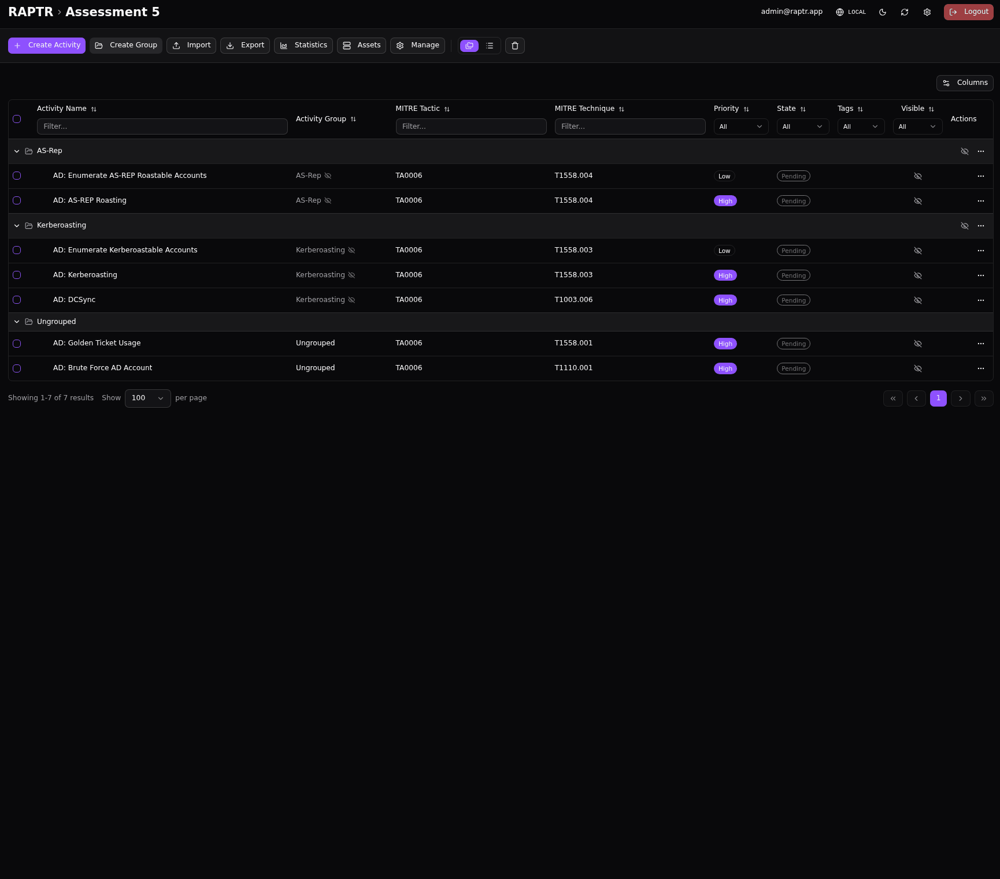](../assets/activity-create.gif){:target="_blank"}

??? bug "Default Group"
    When creating an activity, it is automatically assigned to the default group. Currently it is not possible to directly assign an activity to a group during creation. You can move the activity to a different group after creation.

### Deleting and Restoring Activities

Activities are [soft deleted](deletion.md#soft-delete). This means that they are not permanently deleted, but instead marked as deleted and can be restored later.

??? abstract "Deleting and restoring an activity"
    [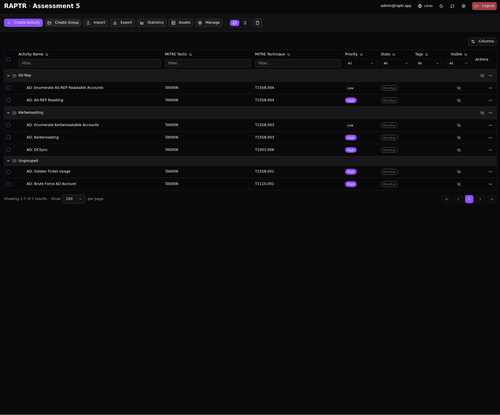](../assets/activity-soft-delete.gif){:target="_blank"}

### Duplicating an Activity

Admins and Red Team members can duplicate an activity to create a copy with all its properties. This is useful when you need a similar activity with small variations.

??? abstract "Duplicating an activity"
    [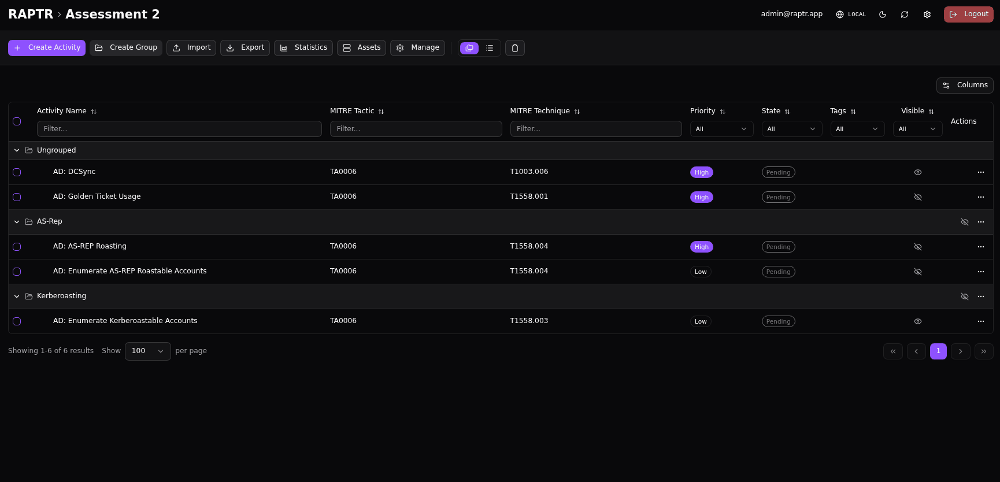](../assets/activity-duplicate.gif){:target="_blank"}

### Bulk Operations

Select multiple activities to perform bulk actions:

- **Bulk Delete**: Soft-delete multiple activities at once
- **Bulk Toggle Visibility**: Show or hide multiple activities
- **Bulk Move to Group**: Assign multiple activities to a group

??? abstract "Toggle visibility in bulk"
    [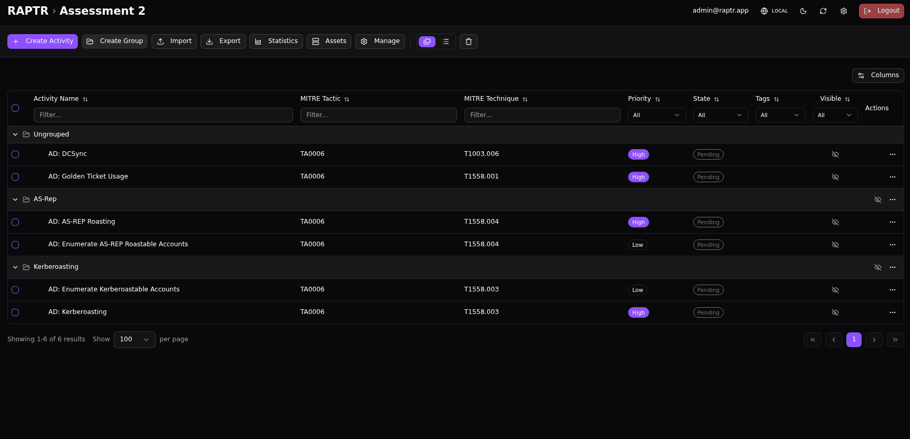](../assets/visibility-toggle-bulk.gif){:target="_blank"}

## Activity Detail View (Form View)

Clicking an activity opens the detail view with a **sidebar** listing all activities and a **main panel** showing the activity form.

### Sidebar

The sidebar offers a quick overview and access to all activities and activity groups in the assessment. The sidebar is:

- Filterable and sortable
- Resizable
- Searchable
- Supports flat and grouped views
- Indicates the state of an activity by [color coded icons](getting_started.md#activity-states)
- Indicates visibility of activities and activity groups by :lucide-eye-off:

??? abstract "Activity sidebar"
    [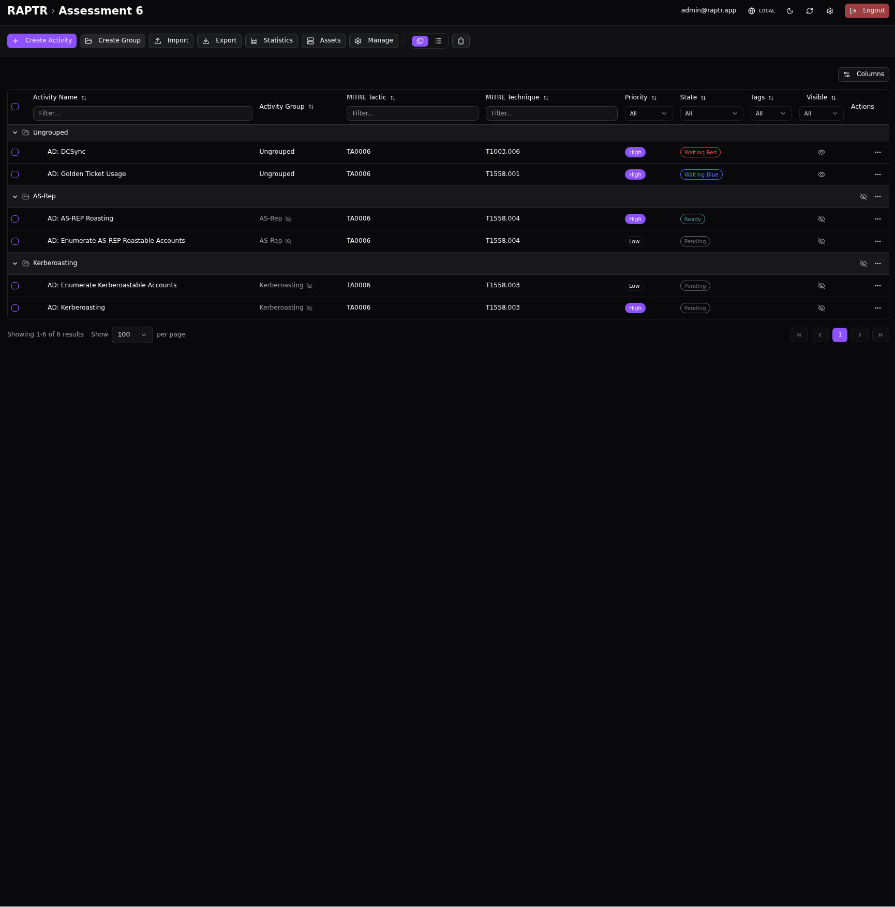](../assets/activity-sidebar.gif){:target="_blank"}

??? bug "Inherited Visibility"
    The UI does currently not calculate the inherited visibility. The visibility icon shown on the activity level indicate only if the current activity is :lucide-eye-off: hidden or :lucide-eye: visible. It does not indicate if the activity is hidden or visible due to the visibility of its parent activity group.

### Main Sections

#### Header

The activity header shows the name and current state. Admins and Red Team members can change the state from the header. Blue Team members can only toggle between **Waiting Blue** and **Waiting Red** (when the activity is in one of those states).

Admins and Red Teamers can also access the :lucide-book-open: [Knowledge Base](knowledge_base.md) and :lucide-history: [History](activities.md#activity-history) sections from the header.

#### General Information

This General section has three main purposes:

1. It defines the activity (the what, the why and the prerequisites)
2. It defines the expected outcome of the activity (the expected result)
3. It defines the status of the activity (state, visibility and tags)

[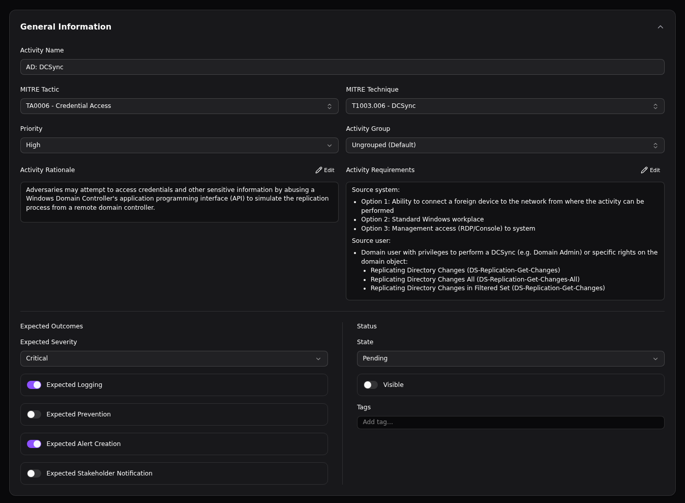](../assets/activity-section-general.png){:target="_blank"}

##### Definition

- **Name**: The activity name
- **MITRE Tactic**: The ATT&CK tactic (e.g., Execution, Persistence)
- **MITRE Technique**: The specific technique or sub-technique (e.g., T1204.001 - User Execution: Malicious Link)
- **Priority**: Use this field to indicate the importance of this activity. How important is it for the Blue Team to detect this activity?
- **Activity Group**: Which activity group this activity belongs to. You can change the group through this dropdown. The [position](assessments.md#order-an-assessment) of the activity in the new group will be at the end
- **Rationale**: Explain why this activity is tested. Supports [Markdown](#markdown-fields)
- **Requirements**: Explain environmental prerequisites that must be in place before execution, see [overcoming requirements hell](getting_started.md#overcoming-requirements-hell). Supports [Markdown](#markdown-fields)

??? bug "Strict MITRE mapping"
    Currently the MITRE mapping is not strictly enforced in the backend. It is possible to create an activity with a MITRE mapping that is not valid. This will lead to the activity not being displayed in the [MITRE ATT&CK Heatmap](evaluation.md#mitre-attck-heatmap) or in the [MITRE ATT&CK Navigator](evaluation.md#mitre-navigator-layer) export. The frontend enforces a strict mapping by only allowing or filtering techniques based on the chosen tactics, and vice versa.

##### Expected Outcomes

This section is used to set the expected outcomes of the activity. The settings here will have direct consequences on the [static evaluation questions](evaluation.md#static-evaluation-questions).

- **Expected Severity**: Set the expected severity for the expected alert and stakeholder notification
- **Expected Logging**: Set whether the activity is expected to be logged
- **Expected Prevention**: Set whether the activity is expected to be automatically prevented
- **Expected Alerting**: Set whether the activity is expected to trigger an alert
- **Expected Stakeholder Notification**: Set whether the activity is expected to trigger a stakeholder notification

!!! info "Alert and Stakeholder Notification terminology"
    The term `Alert` is used in RAPTR for any kind of automatic generated information that the Blue Team receives from the security stack. This can be a SIEM alert, an EDR alert, a firewall alert, etc.

    `Stakeholder Notification` refers to any kind of notification sent to stakeholders. This term originates from the fact that we often test external MSSPs/SOCs on behalf of the customer, without informing the Blue Team about the test. As well as the SOC's detection capabilities, the customer is also interested in testing whether the SOC adheres to defined processes and procedures. For example, SLAs and escalation through defined channels. Using the [evaluation templates](templates.md#evaluation-template), you can define any metric for stakeholder notifications. E.g. quality and correctness of the notification etc. 

??? bug "Only one expected severity"
    Currently there is only one expected severity for alerts and stakeholder notification. The assumption is that both notifications should have the same severity level.

##### States

- **State**: The current state of the activity
- **Visibility**: Whether the activity is visible to Blue Team and Spectators
- **Tags**: Colored labels for categorization

??? abstract "Toggle visibility in form"
    [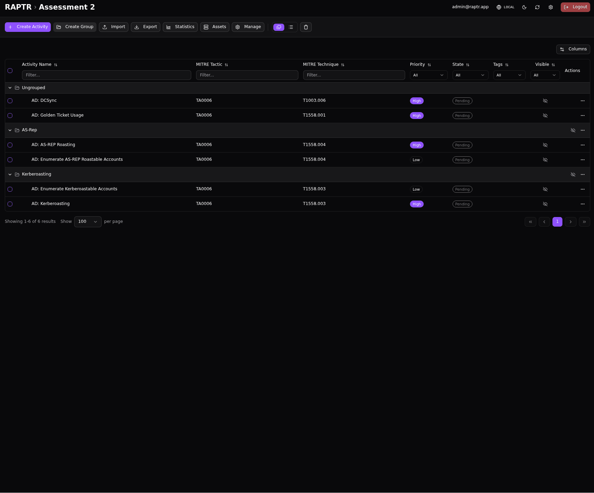](../assets/visibility-toggle-form.gif){:target="_blank"}

??? abstract "Add tags"
    [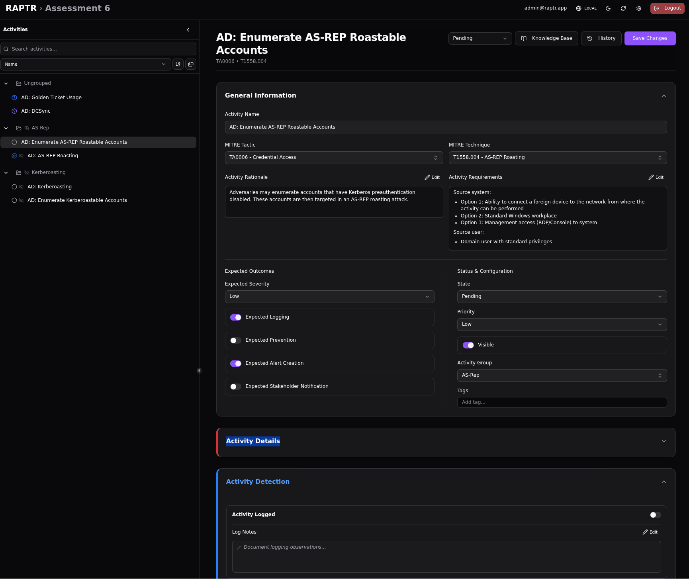](../assets/tag-add.gif){:target="_blank"}

#### Activity Details Section

This section is for documenting the execution of the activity.
[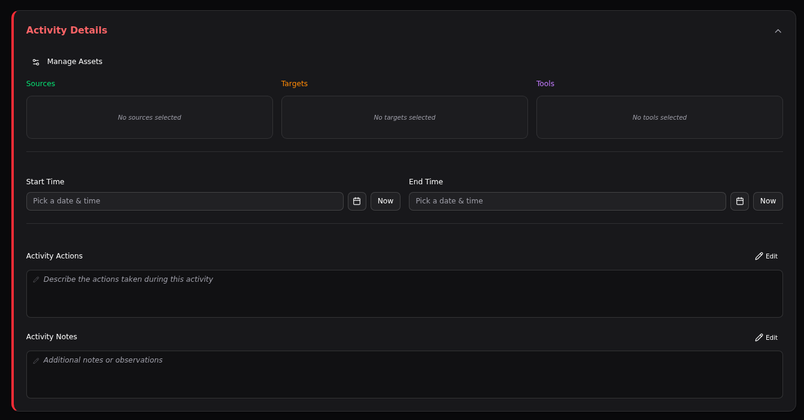](../assets/activity-section-details.png){:target="_blank"}

- **Assets**: Source, Destination and Tool assets can be selected here. See [asset management](assets_and_tags.md) for more information
- **Start Time**: The time when the activity was started used in [static evaluations](evaluation.md#static-evaluation-questions) ([Date and time field](#date-and-time-fields))
- **End Time**: The time when the activity was ended ([Date and time field](#date-and-time-fields))
- **Activity Actions**: Step-by-step instructions on how the activity was executed. Supports [Markdown](#markdown-fields)
- **Activity Notes**: Additional context or observations. Supports [Markdown](#markdown-fields)

??? abstract "Add existing assets"
    [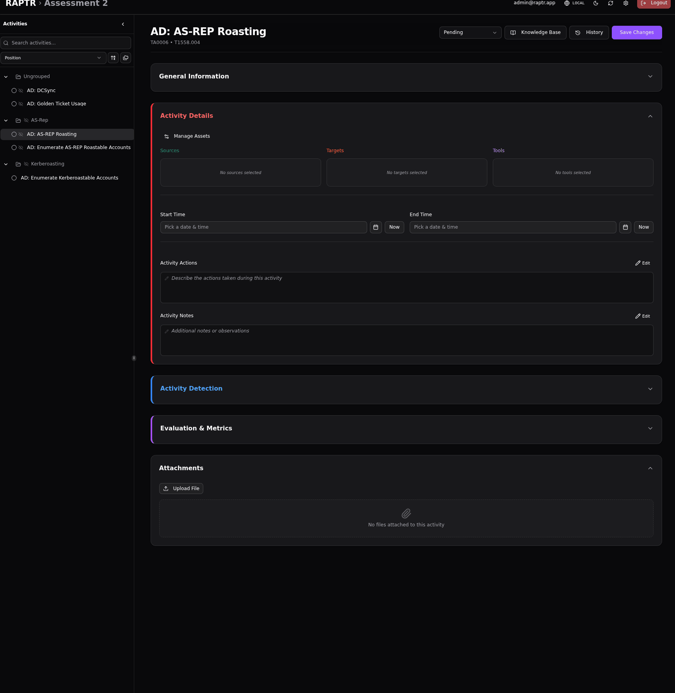](../assets/asset-add-existing.gif){:target="_blank"}

??? abstract "Add new assets"
    [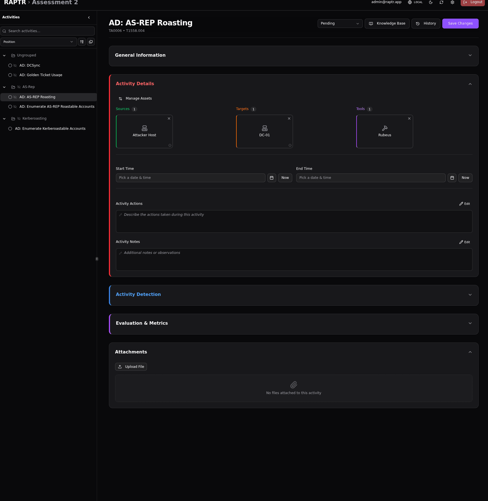](../assets/asset-add-new.gif){:target="_blank"}

#### Activity Detection Section

This section is for documenting the observed result of the activity.

[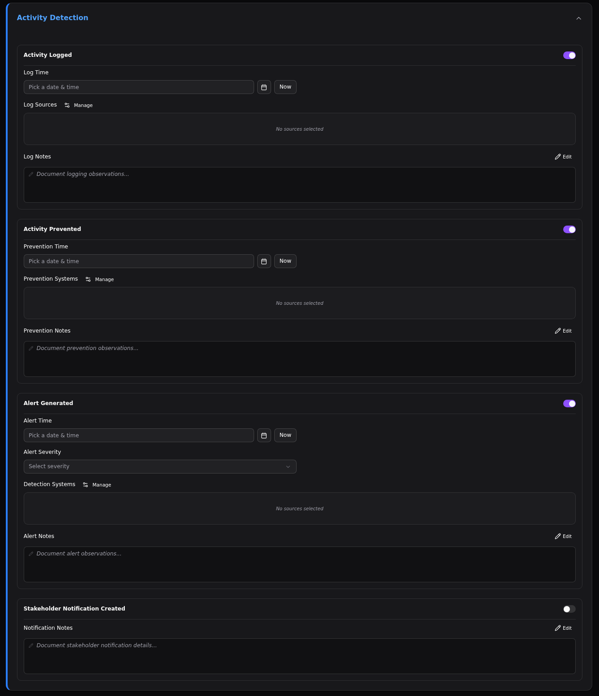](../assets/activity-section-detection.png){:target="_blank"}

| Category | What It Means |
|----------|--------------|
| **Activity Logged** | The activity was captured in system logs (e.g., event logs, SIEM, EDR telemetry). This is the most basic level of detection — the activity left a trace. |
| **Activity Prevented** | A security control actively blocked the activity from succeeding (e.g., EDR quarantine, firewall rule, application whitelisting). |
| **Activity Alerted** | The activity triggered a security alert that would be seen by an analyst (e.g., SIEM correlation rule, EDR alert, IDS signature match). |
| **Stakeholder Notification Created** | A formal notification was sent to stakeholders or management about the activity (e.g., escalation to incident response, SOC notification to leadership). This measures the full detection-to-communication chain. |

For each category the Blue Team records whether the detection actually occurred along with the following additional data:

- **Detection notes** for each category the Blue Team can explain their observations in detail, regardless of whether the detection actually occurred. Supports [Markdown](#markdown-fields)
- **Detection timestamp** for each category a timestamp can be recorded to indicate when the detection occurred. This is used in the [static evaluation](evaluation.md#static-evaluation-questions). ([Date and time field](#date-and-time-fields))
- **Detection assets** can be linked to show which systems ([log sources, prevention sources, alert sources, stakeholder notification sources](assets_and_tags.md#linking-assets-to-activities)) were involved.
- **Detection severity** for Alert and Stakeholder Notification the occured severity can be recorded, this is used in the [static evaluation](evaluation.md#static-evaluation-questions)

#### Evaluation Section

The evaluation section shows how the activity performed against expectations. It is split in two main parts:

1. The [static evaluation](evaluation.md#static-evaluation-questions)
2. The [dynamic evaluation](evaluation.md#dynamic-evaluation-questions)

[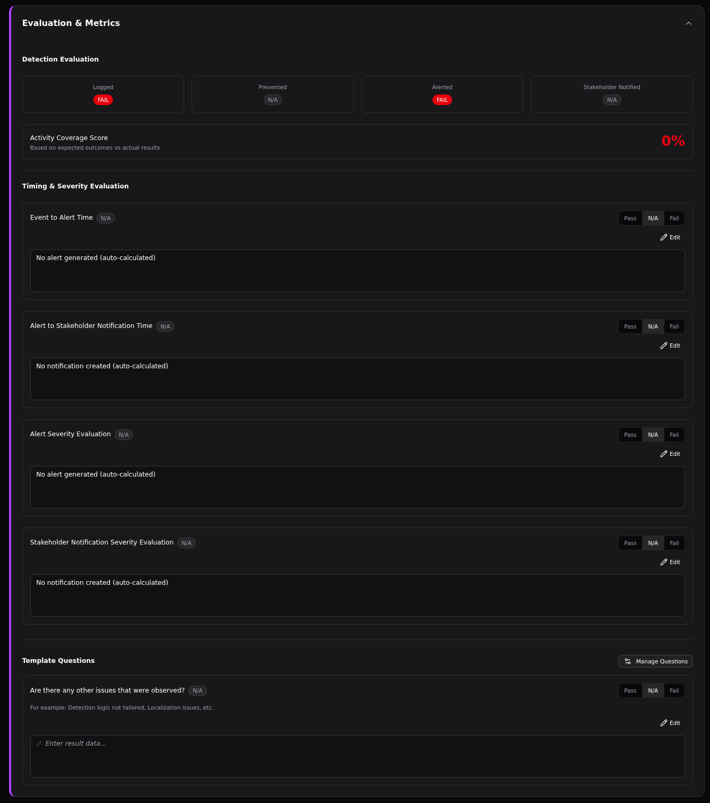](../assets/activity-section-evaluation.png){:target="_blank"}

##### Static Evaluation Questions

The static evaluation section shows the following data:

- **Overview** of pass/fail/N/A for each detection category. Based on expected vs occured detection
- **Activity Coverage Score** shows a percentage value of checks that passed
- **Timing evaluations** for measuring the `Event to Alert` and `Alert to Stakeholder` notification time (auto-calculated)
- **Severity evaluations** for measuring the occured severity for alert severity and stakeholder notification severity (auto-calculated)

??? abstract "Working with evaluation questions"
    {:target="_blank"}

??? bug "Auto-calculated fields"
    The timing and severity static evaluation questions text is auto-calculated. Nevertheless these fields support [Markdown](#markdown-fields). You can overwrite the fields. As long as the field ends in `(auto-calculated)` the field will be re-calculated on changes.
    {:target="_blank"}

##### Dynamic Evaluation Questions

You can either add new [evaluation template](templates.md#evaluation-template) questions here or if you added them to the [default evaluation questions](assessments.md#default-evaluation-templates) on the assessment level they will appear here as well.
The dynamic evaluation questions can be used for any kind of evaluation that is not covered by the static evalaution questions.

??? abstract "Working with dynamic evaluation questions"
    {:target="_blank"}

#### Attachments

Upload files as evidence or supporting documentation. Files are categorized as either **Red** (from the Red Team) or **Blue** (from the Blue Team). Supported file types include PNG, JPEG, JPG, and TXT.
[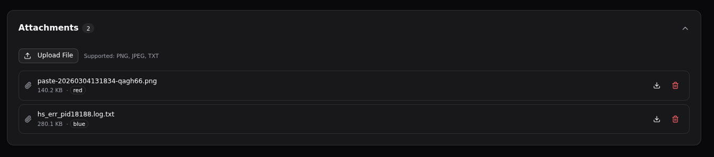](../assets/activity-section-attachments.png){:target="_blank"}

??? bug "File size restriction"
    Currently there is no file size limit.

??? bug "File renaming"
    All text files will have the extension `.txt` appended to their name upon upload.

### Markdown Fields

All free text fields in the activity form support Markdown formating. Furthermore it allows you to paste images directely from your clipboard. 

??? abstract "Working with Markdown Fields"
    [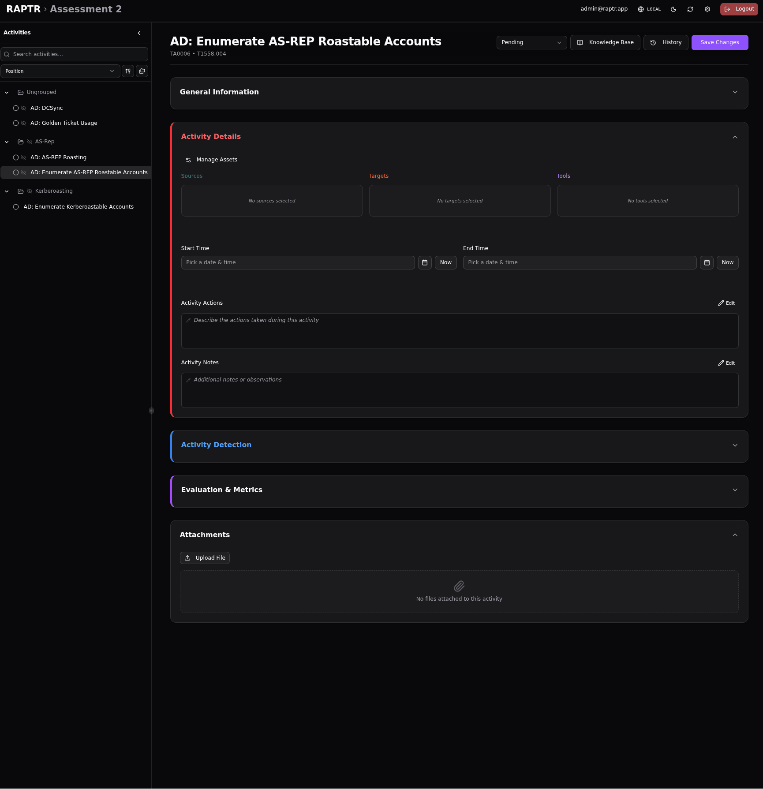](../assets/activity-markdown-fields.gif){:target="_blank"}

??? info "Markdown export in report"
    Both the HTML and DOCX report templates convert Markdown fields. However, not all Markdown syntax is appropriate for reports. For example, adding a heading at level 1 to a Markdown field will render it as a heading level 1 in the report. This may not be what you want.

??? tip "Copy pasted images"
    Images that were uploaded via copy paste into a Markdown field will appear in the [Attachments](#attachments) section of the activity. From there you can [permanently delete](deletion.md#permanent-delete) them if you want to.

### Date and Time Fields

You can change between UTC and your local time from the [toolbar](user_preferences_and_ui.md#toggle-utc-and-local-time).

The format used to display time (`24h` or `AM/PM`) and date format (e.g. `MM/DD/YYYY` or `DD/MM/YYYY`) can be configured in your [profile settings](user_preferences_and_ui.md#timezone-and-date-format).

Use the :lucide-calendar: calendar or the **now** button to set the date and time. You can also type a date and time directely into the field. RAPTR will do its best to parse the date and time you enter.

??? tip "UTC in database"
    All date and time values are stored in UTC in the database.

??? abstract "Toggle between UTC and local time"
    [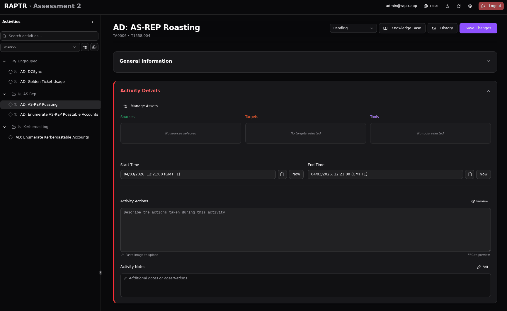](../assets/ui-toggle-utc-local.gif){:target="_blank"}

??? abstract "Configure date and time format"
    [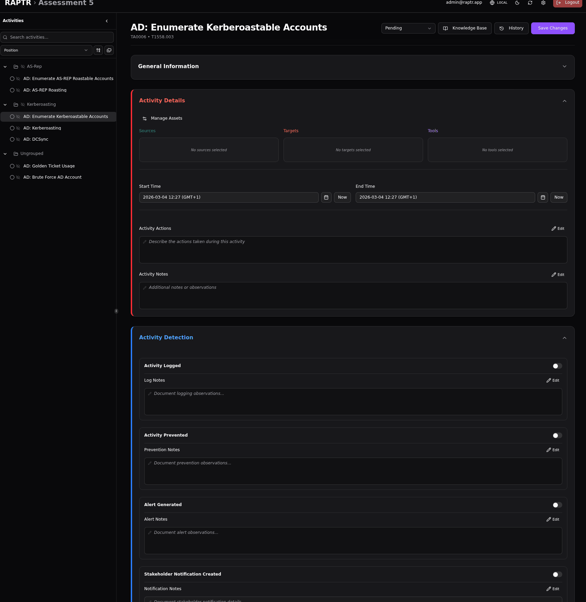](../assets/ui-configure-datetime.gif){:target="_blank"}

### Activity History

Each time an activity is saved, a versioned copy is stored in the database. Through the history function, administrators and Red Team members can view an activity's history. Everything except the attachments is preserved. Therefore, even if an asset is modified, the snapshot reflects its state at the time the activity was saved. The versioned copy is **read only**.

??? abstract "Activity History"
    [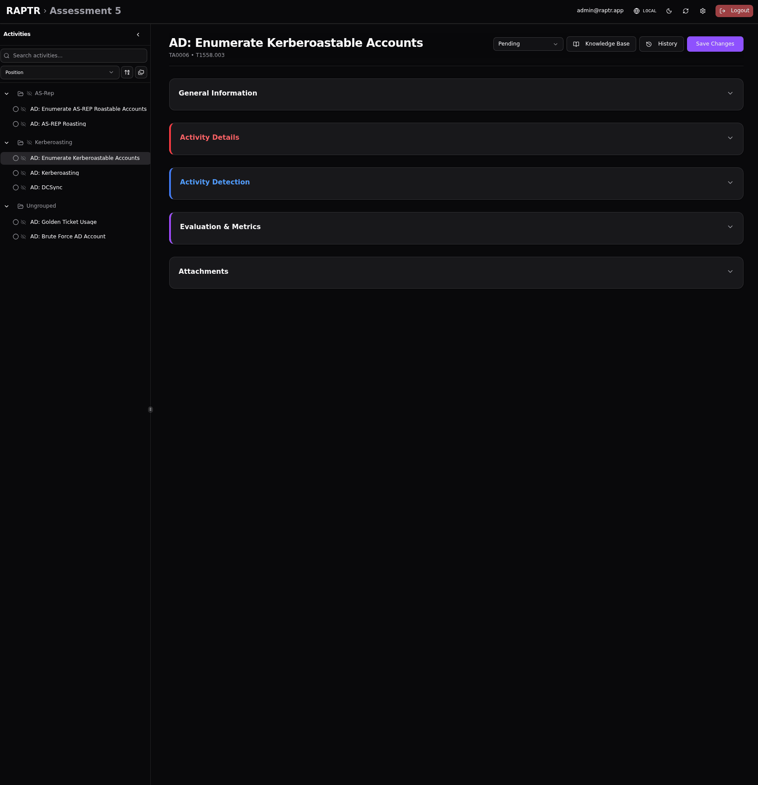](../assets/activity-history.gif){:target="_blank"}

??? bug "Snapshots are not in assessment export"
    The versioned snapshots are not contained in the [export of an assessment](assessments.md#exporting-an-assessment).

### Conflict Resolution

When two users edit the same activity simultaneously, RAPTR detects the conflict and presents a **3-way merge** dialog. You can review the differences between your changes and the other user's changes, then choose which version to keep or manually resolve conflicts.

??? abstract "Conflict Resolution"
    [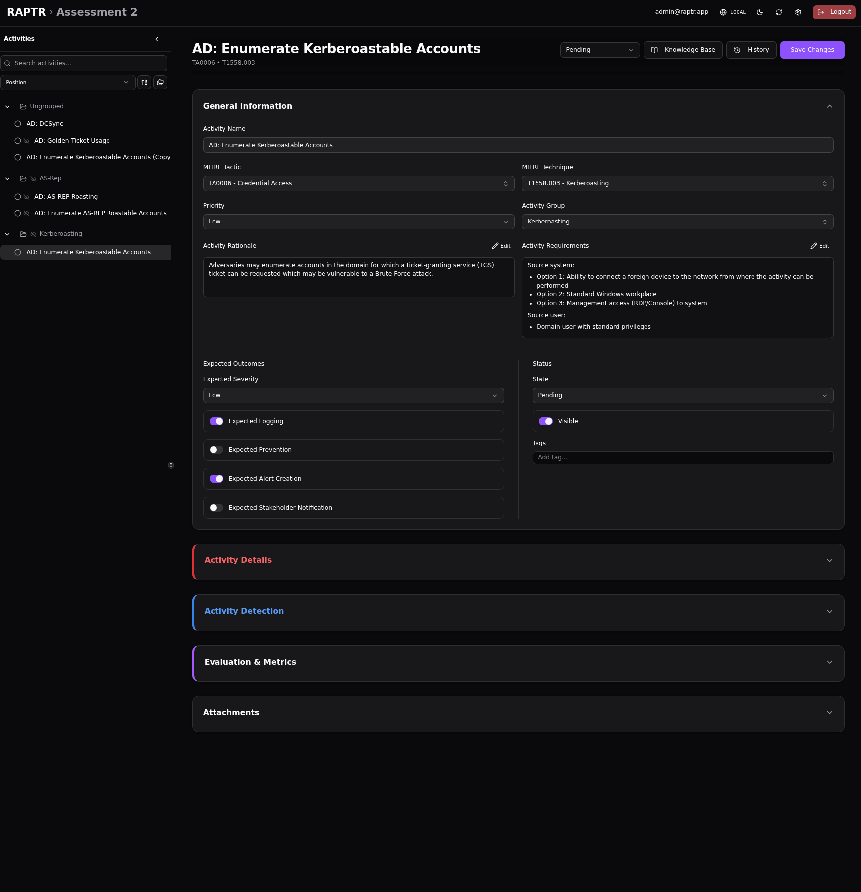](../assets/activity-conflict-resolution.gif){:target="_blank"}

## Activity Groups

### Creating a Group

Admins and Red Team members can create activity groups from the assessment toolbar to organize related activities.

??? abstract "Create an activity group"
    [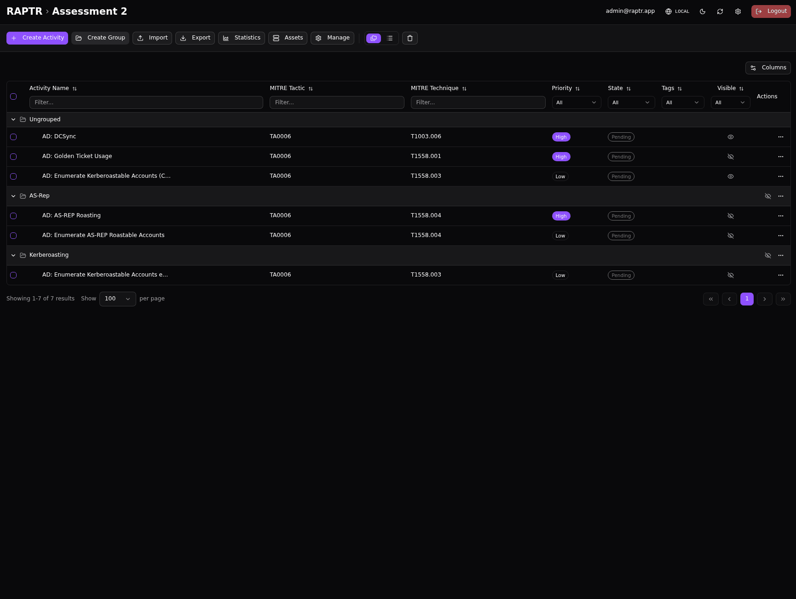](../assets/activity-create-group.gif){:target="_blank"}

### Moving Activities to Groups

To move an activity to an activity group you have multiple options:

- From the activity table through the `...` actions dialog of an activty
- From the activtiy table via bulk operation
- From the activity detail [General information](activities.md#general-information) section
- Through the reorder function

??? abstract "Move single activity"
    [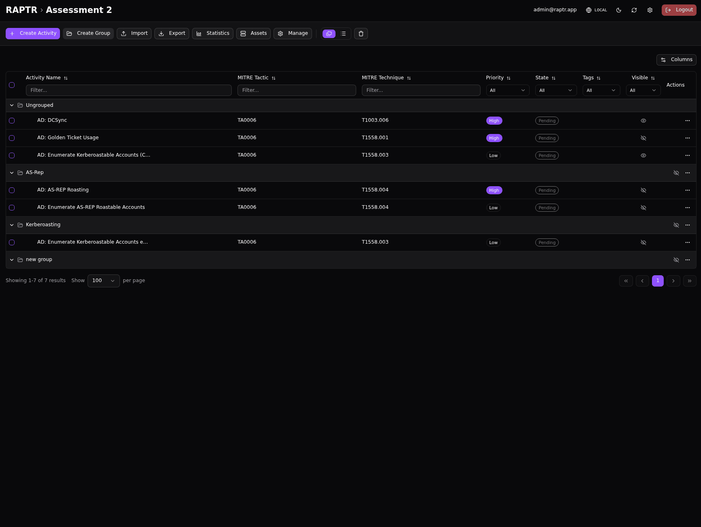](../assets/activity-move-form.gif){:target="_blank"}

??? abstract "Move activities in bulk"
    [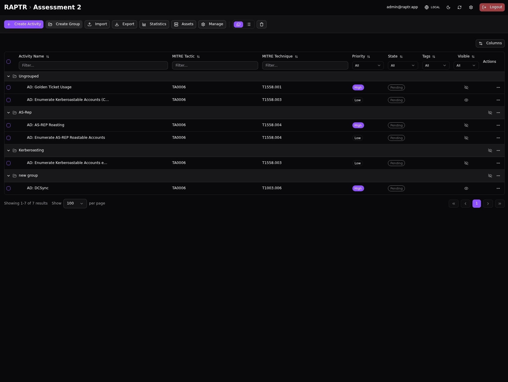](../assets/activity-move-bulk.gif){:target="_blank"}

### Reordering

Both activity groups and activities within groups can be [reordered](assessments.md#order-an-assessment) using the reorder function.

### Visibility

Groups can be toggled visible or hidden independently of their activities. Hiding a group hides all activities within it from Blue Team and Spectator users. See [Visibility](visibility.md) for more information.

### Deleting and Restoring

Groups support **soft delete** — deleted groups can be restored. See [Deletion](deletion.md) for more information.