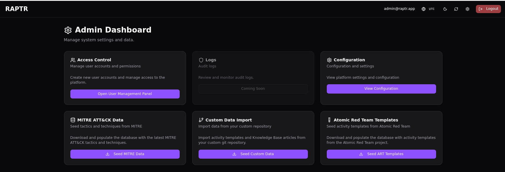
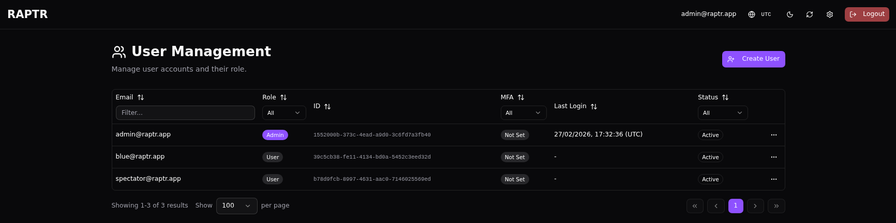
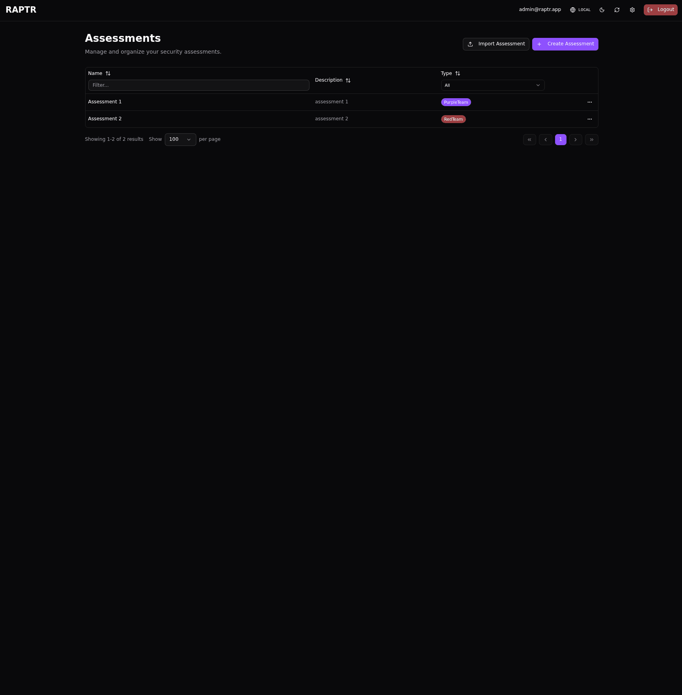
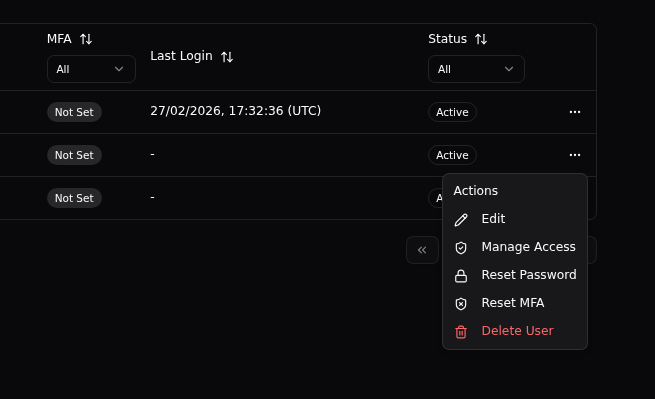

# Administration

This section covers in-app administration tasks that require the **Admin** [system role](user_types.md#system-roles). These are features accessed from the admin panel within RAPTR itself.

??? info "Looking for deployment or infrastructure setup?"
    For hosting, Docker configuration, environment variables, and database setup, see the [Admin Guide](../admin-guide/index.md).

## Admin Panel

The admin panel `/admin` is accessible from the navigation menu and provides quick access to all administration features.
{:target="_blank"}

### Seeding Data

The admin panel provides options to populate RAPTR with reference data and templates. Each seed operation behaves differently — some update existing records in place, while others fully replace all data of that type.

??? info "Seeding URLs and Templates"
    Check the [administration guide](../admin-guide/index.md) on how to configure and manage seeding URLs and templates.

#### MITRE ATT&CK Data

Seed the latest MITRE ATT&CK tactics and techniques into the system. This populates the tactic and technique dropdowns used when creating activities.

**Behavior: Update only.** Existing tactics and techniques are updated by their MITRE ID (name and URL are refreshed). New entries are added. No records are deleted — re-seeding is safe and can be run at any time to pull the latest ATT&CK framework version. 

??? Bug "MITRE full re-seed"
    Note that if tactics or techniques are removed or archived in the new ATT&CK framework, they will not be removed from the database.
    Since the MITRE ATT&CK data is not linked (no foreign keys on activities) and only used as a "dictionary", a full re-seed would be possible without negative consequences.

#### Atomic Red Team Templates

Import activity templates from the [Atomic Red Team](https://github.com/redcanaryco/atomic-red-team) library. These provide pre-built activity definitions for common attack techniques, complete with MITRE mappings and execution instructions.

**Behavior: Full re-seed (ART only).** All activity templates with the provider `ART` are deleted and recreated from the latest source. Custom activity templates (non-ART) are not affected.

#### Custom Data

Import templates and reference data from your organization's git repository. This allows you to maintain a private library tailored to your engagement methodology. The custom data seed imports several data types at once, each with different behavior:

| Data Type | Behavior | Details |
|-----------|----------|---------|
| **Activity templates** | Full re-seed | All activity templates that do not have the `ART` provider, as well as activity group and campaign templates, are deleted and recreated from the repository. |
| **Activity group templates** | Full re-seed | Deleted as part of the activity template import, then recreated with their activity associations. |
| **Campaign templates** | Full re-seed | Deleted as part of the activity template import, then recreated with their group and activity references. |
| **Knowledge base articles** | Full re-seed | All existing articles are deleted and replaced with the imported set. |
| **Report templates** | Full re-seed | All existing report templates (DOCX and HTML) are deleted and replaced entirely. |
| **Evaluation templates** | Update only | Existing templates are updated by name (criteria and description are refreshed). New templates are added. No templates are deleted — this preserves template IDs that may be referenced in assessment default configurations or in activities. |

??? warning "Custom data seed replaces most template data"
    Running the custom data seed will **delete and recreate** all none `ART` provider activity templates, activity group templates, campaign templates, knowledge base articles, and report templates. Only evaluation templates are preserved and updated in place. Make sure your git repository contains the complete set of data you want in the system.

## View System Configuration

The configuration page `/admin/configuration` displays all current system settings (read-only). These settings are configured via environment variables at deployment time and cannot be changed from within the application.

Displayed settings include:

- **General**: application name, log level, admin email, welcome message
- **Security**: minimum password length, OTP settings, JWT configuration, token expiry
- **Database**: PostgreSQL connection details
- **External Resources**: URLs for MITRE data, Atomic Red Team templates, and custom template repositories
- **External Authentication**: OAuth/OIDC provider configuration (issuer, JWKS URL, audience, trusted domains, client settings)

To change these settings, see the [Admin Guide](../admin-guide/index.md).

## User Management

The user management page `/admin/users` displays all users in a filterable table.

{:target="_blank"}

??? Bug "Last Login Time"
    When a user logs in using OAuth/OIDC, their last login time is not updated. This is because the login occurs on the IdP and not on the system itself. The last login time is only updated when a user logs in using local authentication.

### Creating a User

1. Click :lucide-user-plus:**Create User**
2. Provide the user's **email address**
3. Set an **initial password**
4. Assign a **system role** (Admin or User)

??? abstract "Create a new user"
    {:target="_blank"}

??? info "User Invitation"
    RAPTR does not send any E-Mails. After user creation, share the credentials with the user. They can change their password from the [profile page](user_preferences_and_ui.md#password).

??? Bug "Initial Password"
    At its current stage, it is not possible to set or mark a user's password so that it must be changed upon first login.

### User Actions Dialog

From the Actions dialog `...`, you can perform multiple actions on a user level.
{:target="_blank"}

#### :lucide-pencil: Edit

Update a user's email address, system role or account status.

??? info "Default Administrator"
    The default administrator cannot be edited.

??? tip "Disable Accounts"
    Disable a user account to prevent them from logging in without deleting their account. Disabled accounts retain their assessment roles and can be re-enabled later.

#### :lucide-shield-check: Manage Access

Configure the users [assessment roles](user_types.md#assessment-roles). This view provides an overview of the user's assessment roles across all assessments.

#### :lucide-lock: Reset Password

Force a password reset for a user. This is useful when a user has forgotten their password.

#### :lucide-shield-x: Reset MFA

Clear a user's MFA configuration, allowing them to set up a new authenticator device on their next login. Use this when a user has lost access to their authenticator app.

#### :lucide-trash-2: Delete User

Permanently remove a user account from the system. 

!!! danger "Irreversible"
    This action cannot be undone. All associated database fields (`created_by`, `updated_by`, etc.) will be updated to `None`. You will lose this information when you delete a user. Consider [disabling the account](administration.md#edit) instead.

## Assessments

For creating, editing, and managing assessments, see [Managing Assessments](assessments.md).
