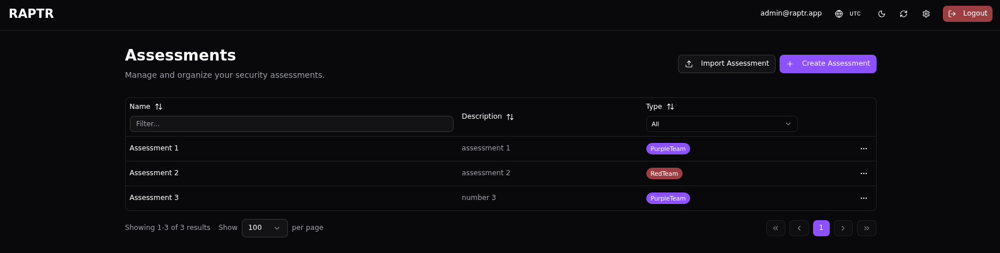
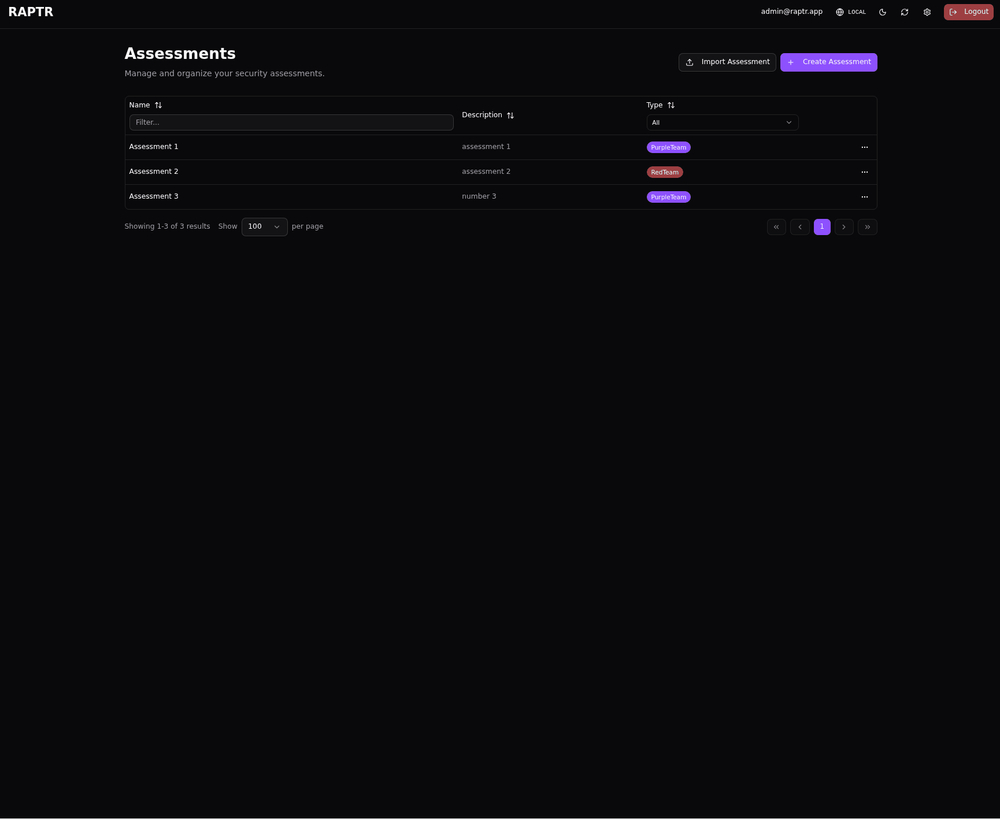
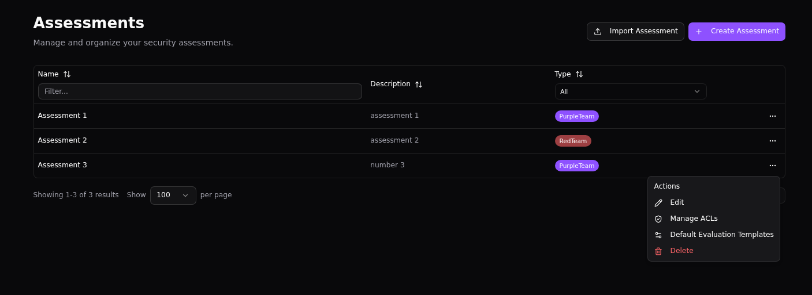
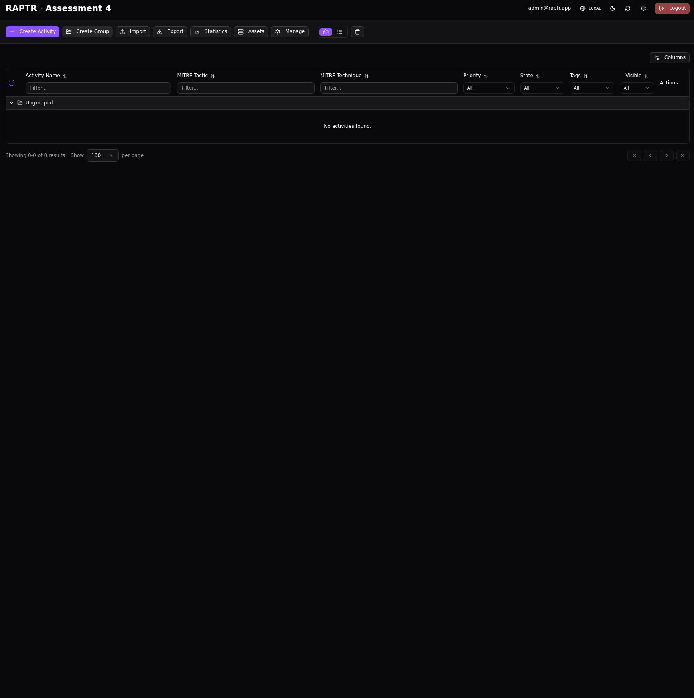
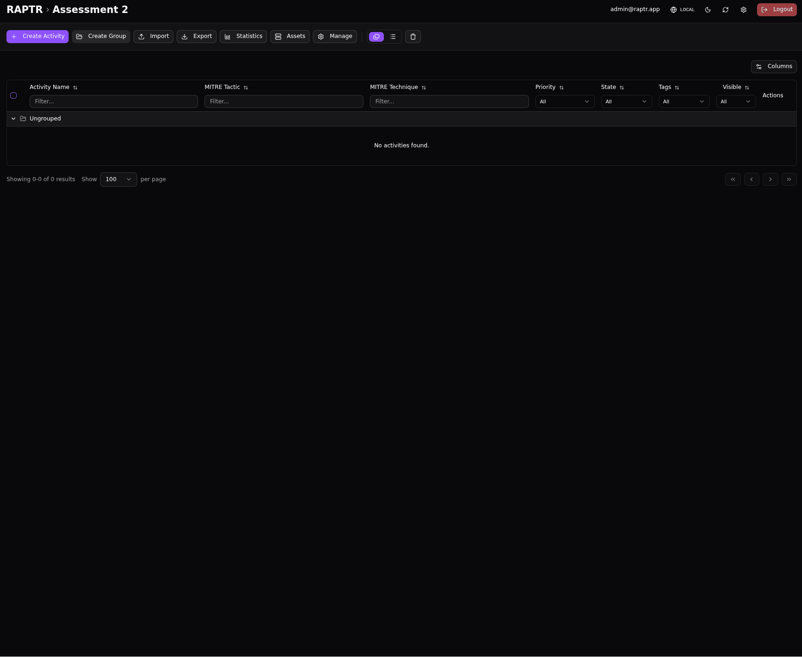
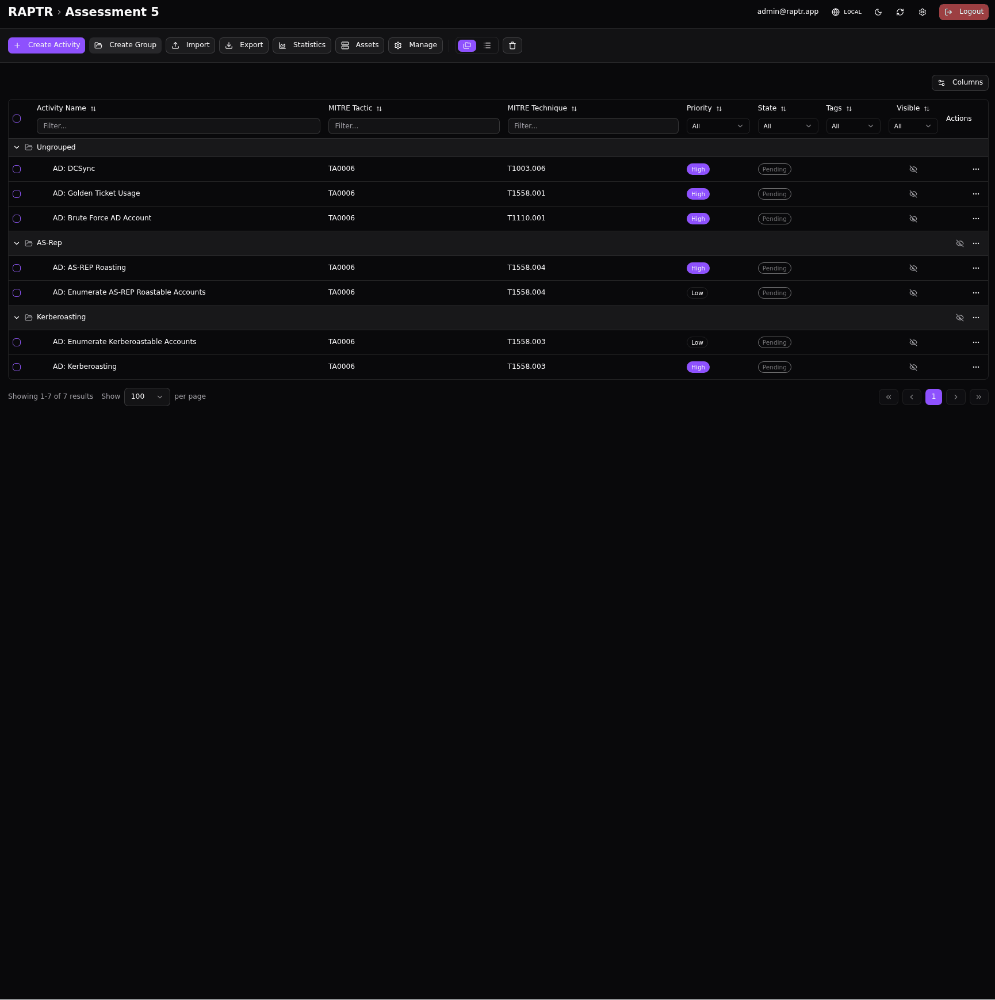
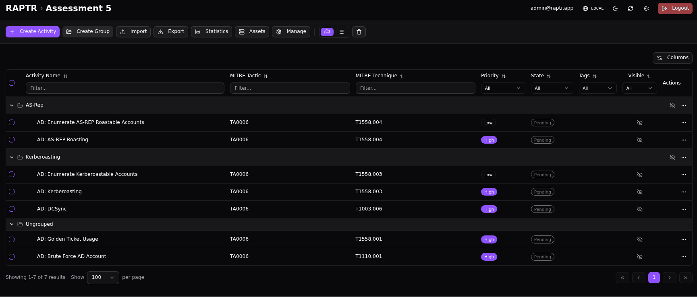
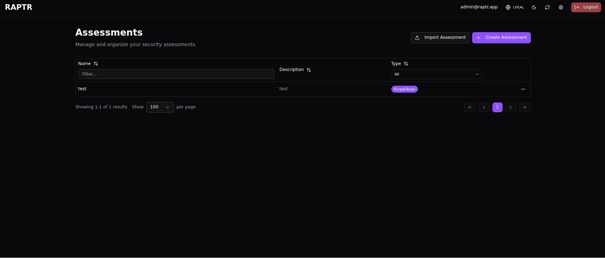

# Managing Assessments

Assessments are the top-level containers in RAPTR. This page covers how to create, configure, and manage them.

## Viewing Assessments

The home page `/` displays all assessments you have access to in a filterable table. You can:

- **Filter** by name, description, or assessment type (Purple Team / Red Team)
- **Sort** by any column
- Click an assessment to open it

If you are not an admin, you will only see the assessments that have been assigned an [assessment role](user_types.md#assessment-roles) to you.

{:target="_blank"}

## Creating an Assessment

??? info "Admin only"
    Only administrators can create new assessments.

To create a new assessment, click the **+ Create Assessment** button in the top-right corner of the home page `/`.

1. Provide a **name** and **description** for the assessment
2. Select the **assessment type**: **Purple Team** (collaborative Red + Blue) or **Red Team** (offensive-only)
3. Confirm to create the assessment

After creation, you will need to [assign users](#managing-access-control) before they can access it.

??? abstract "Create an assessment"
    {:target="_blank"}

??? bug "Assessment Type"
    Currently, there is no difference whether you choose **Purple Team** or **Red Team** as your assessment type. It is planned that RAPTR could display different UI elements based on the assessment type selected. This is not currently implemented.

## Assessment Actions Dialog

The assessment actions dialog `...` on the home page `/` offers options to manage each assessment.

{:target="_blank"}

### :lucide-pencil: Editing an Assessment

Update the assessment's name, description, or assessment type (Purple Team / Red Team).

??? abstract "Edit an assessment"
    {:target="_blank"}

### :lucide-shield-check: Managing Access Control

??? info "Admin only"
    Only administrators can manage assessment ACLs.

Configure the Access Control List (ACL) for the assessment. Assign users an [assessment role](user_types.md#assessment-roles) — **Red**, **Blue**, or **Spectator** — to grant them access. Each user can hold only one role per assessment. Users without a role cannot see the assessment.

??? abstract "Manage access control"
    {:target="_blank"}

### :lucide-settings-2: Default Evaluation Templates

Select which additional [evaluation templates](templates.md#evaluation-template) are automatically applied to new activities created in this assessment. This saves time by pre-assigning the relevant evaluation criteria so they don't need to be added manually to each activity.

??? abstract "Add and order default evaluation templates"
    {:target="_blank"}

??? bug "Changing default evaluation templates"
    Changing the default evaluation templates does not affect existing activities. It only affects new activities created after the change.

### :lucide-trash-2: Deleting an Assessment

??? info "Admin only"
    Only administrators can delete assessments.

!!! danger "Irreversible"
    Deleting an assessment permanently removes it and all its contents (activities, groups, assets, tags, ACLs). This action cannot be undone.

??? abstract "Delete an assessment"
    {:target="_blank"}

## Importing Templates and Campaigns

RAPTR supports importing [pre-built content](templates.md) into an assessment to avoid starting from scratch:

### Activity Templates

Import individual activity templates from the template library. These are pre-configured activities with MITRE mappings, expected outcomes, and descriptions already filled in. You can select which templates to import and they will be added as new activities.

??? abstract "Import activity template"
    {:target="_blank"}

### Activity Group Templates

Import pre-configured groups of activities. The group and all its activities are imported together, preserving their organization.

??? abstract "Import activity group template"
    {:target="_blank"}

### Campaign Templates

Import an entire campaign — a collection of activity groups and individual activities arranged in a specific order. This is the fastest way to populate a new assessment with a full engagement plan.

??? abstract "Import campaigns"
    {:target="_blank"}

## Order an Assessment

Each activity group holds a distinct position within the assessment. Each activity also has a distinct position within its group. You can reorder activity groups and activities within them by dragging and dropping them in the :lucide-arrow-down-up: **Manage Order** menu. You can also re-assigne an activity from one activity group to another here.

??? info "Why order matters"
    The order of activities and activity groups is essential if you need to export (e.g. for your report) in a specific order that is not offered by the existing sorting options.

??? abstract "Order an assessment"
    {:target="_blank"}

## Exporting an Assessment

Admins and Red Team members can export an entire assessment as a **ZIP file**. This export contains all activities, groups, assets, tags, and configuration — everything needed to recreate the assessment. The export can be imported into another RAPTR instance.

To export:

1. Open the assessment
2. Click **Export** > **Entire Assessment** in the toolbar
3. The browser will automatically download the generated ZIP file

??? abstract "Export an assessment"
    {:target="_blank"}

??? bug "Evaluation questions"
    The evaluation question templates are not exported with the assessment export.

## Importing an Assessment

??? info "Admin only"
    Only administrators can import assessments.

To import a previously exported assessment:

1. On the home page, click **Import Assessment**
2. Upload the ZIP file
3. The assessment will be created with all its contents restored

??? abstract "Import an assessment"
    {:target="_blank"}

??? bug "Dropped dynamic evaluation questions"
    The dynamic evaluation questions (evaluation templates) are not exported with the assessment export. These templates are system-wide resources, not assessment scoped. If you are importing an assessment that contains dynamic evaluation questions, you must ensure that these questions are present on the new system. Otherwise, the dynamic evaluation questions on the activities will be dropped. A notification toast will be shown.

??? bug "Imported assessment name"
    The name of the assessment will be the same as the exported assessment. The assessment name is not unique, so multiple assessment with the same name can exist which can be confusing. Note the assessment ID in the URL to distinguish between assessments with the same name.