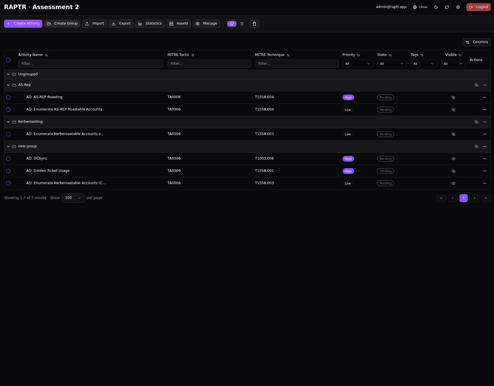
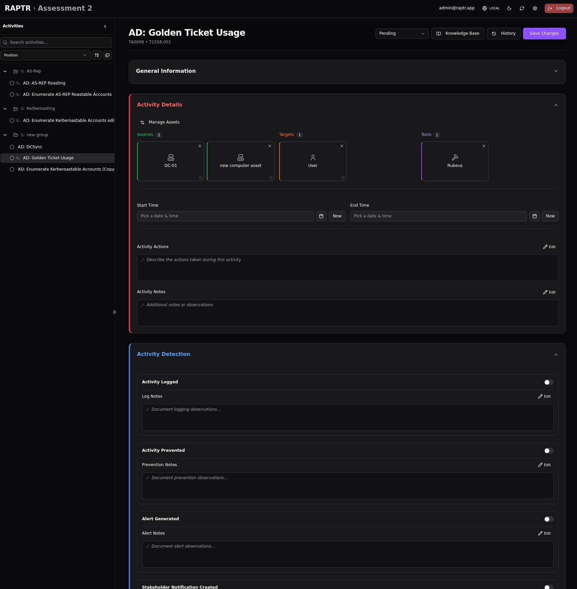

# Assets and Tags

Assets and tags help you organize and contextualize your assessment activities.

## Assets

Assets represent the infrastructure and systems involved in your assessment — servers, workstations, security tools, network devices, and anything else relevant to the engagement.

### Managing Assets

There are two options for managing assets for an assessment:

1. Open the assessment
2. Click :lucide-server: **Assets** in the assessment toolbar
3. From here you can create, edit, and delete assets

Alternatively, within an activity form, click on :lucide-settings-2: **Manage Assets** in the section where an asset can be linked.

### Creating an Asset

Each asset has:

- **Name**: A descriptive identifier (e.g., "DC01", "Splunk SIEM", "Attacker Kali Box")
- **Icon**: An optional icon for visual identification
- **Properties**: Flexible key-value pairs for any metadata you need

Properties are free-form — you can store whatever is relevant for your assessment:

| Example Property | Value |
|-----------------|-------|
| `ip` | `192.168.1.10` |
| `hostname` | `dc01.corp.local` |
| `os` | `Windows Server 2022` |
| `mac` | `00:11:22:33:44:55` |
| `role` | `Domain Controller` |

??? abstract "Creating an asset"
    {:target="_blank"}

??? bug "Asset icon names"
    Currently the Lucide icon name is displayed and not a more user friendly name.

### Linking Assets to Activities

Assets are linked to activities with a specific **role** describing how the asset is involved:

- **Source**: The system from which the attack originates (e.g., the attacker's workstation)
- **Target**: The system being attacked (e.g., a domain controller)
- **Tool**: A tool used in the activity (e.g., Cobalt Strike, Mimikatz)
- **Log Source**: The system that captured logs of the activity (e.g., SIEM, EDR)
- **Prevention Source**: The system that blocked the activity (e.g., firewall, EDR)
- **Alert Source**: The system that generated an alert (e.g., SIEM, SOAR)
- **Stakeholder Notification Source**: The system that produced a notification to stakeholders

Source, target, and tool assets are typically set by the **Red Team** during activity planning. Log, prevention, alert, and stakeholder notification source assets are typically set by the **Blue Team** during detection review.

??? abstract "Linking assets to activities"
    {:target="_blank"}

### Editing and Deleting Assets

Assets can be edited to update their name, icon, or properties at any time. Deleting an asset will [soft delete](deletion.md#soft-delete) it. You can view soft deleted assets through the :lucide-trash-2: symbol.

In the activity details, soft deleted assets will be reprecented through a dotted line.

??? abstract "Soft delete assets"
    {:target="_blank"}

## Tags

Tags are colored labels used to optionally categorize and filter activities within an assessment.

### Creating Tags

Tags can be created inline when editing an activity — simply type a new tag name and select a color. Tags are scoped to the assessment, so they are shared across all activities within that assessment.

??? abstract "Add tags"
    {:target="_blank"}

??? bug "Tag colors"
    Currently, the color is assigned randomly when a tag is created.

??? bug "Missing tag management"
    Currently the frontend has no UI implemented to delete existing tags. You can delete created tags through the API.

### Using Tags

- Apply one or more tags to any activity from the activity detail view
- Use tag filters in the activity table to quickly find activities by category
- Tags are visible in both grouped and flat views

Common tag examples:

- **Phase 1**, **Phase 2** — to track engagement phases
- **High Priority**, **Quick Win** — to flag importance
- **Credential Access**, **Lateral Movement** — to group by attack category
- **Blocked**, **Needs Review** — to track status beyond the workflow state
