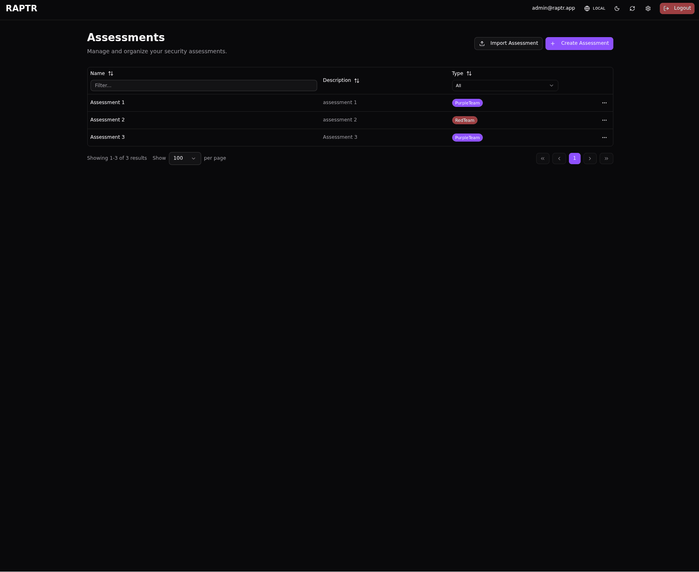

# Deletion

RAPTR distinguishes between two types of deletion depending on the object.

## Soft Delete

Activities, activity groups, assets, and tags support **soft delete**. When you delete one of these objects, it is not immediately removed from the database — instead, it is marked as deleted and hidden from normal views.

- Soft-deleted items can be :lucide-undo-2: **restored** at any time
- Use the :lucide-trash-2: Show Deleted filter to reveal soft-deleted items
- Deleted items appear with a visual indicator so they are easy to distinguish
- Soft-deleted items record who deleted them and when

This is the default behavior when you delete activities or groups from the assessment view. It acts as a safety net, allowing you to recover items that were deleted by mistake.

??? abstract "Deleting and restoring an activity"
    {:target="_blank"}

## Permanent Delete

**Assessments**, [**attachments**](activities.md#attachments), and **users** are permanently deleted — there is no soft delete or recovery. Deleting an assessment removes it and all of its contents (activities, groups, assets, tags, ACLs) irreversibly.

??? abstract "Delete an assessment"
    {:target="_blank"}

## Summary

| Object | Delete Type | Recoverable |
|--------|-----------|:-----------:|
| Assessment | Permanent | No |
| Activity | Soft delete | Yes |
| Activity Group | Soft delete | Yes |
| Attachments | Permanent | No |
| Asset | Soft delete | Yes |
| Tag | Soft delete | Yes |
| User | Permanent | No |
