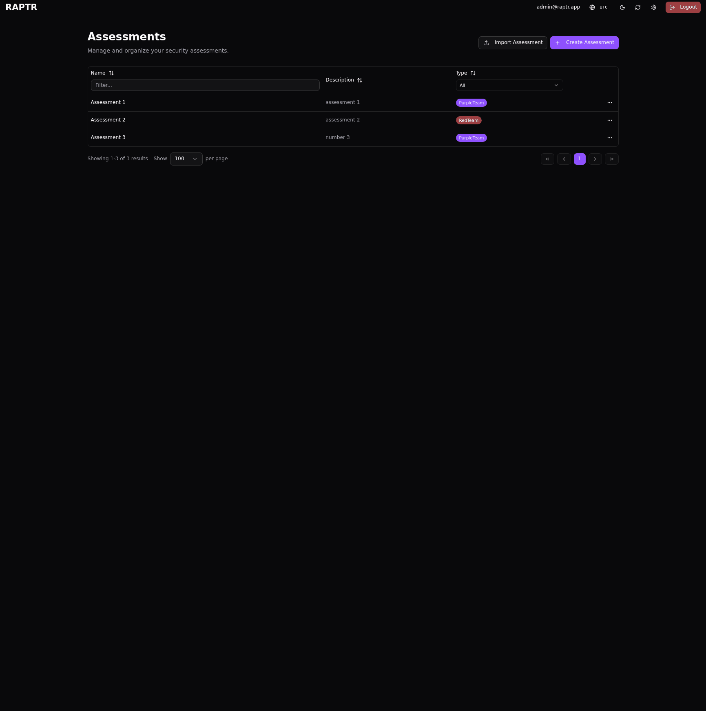
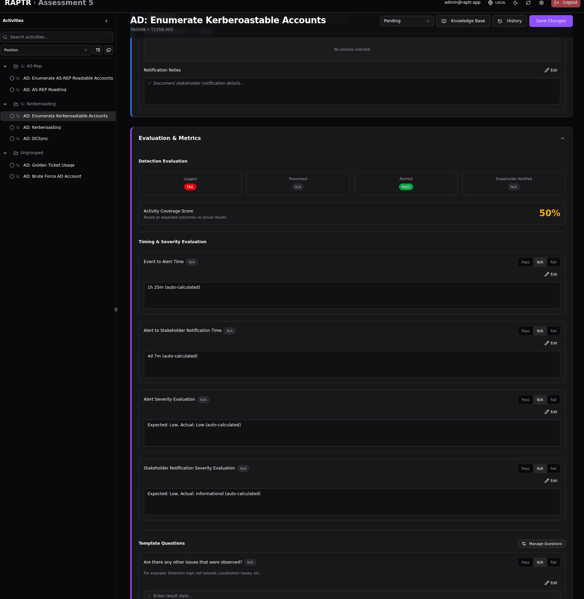
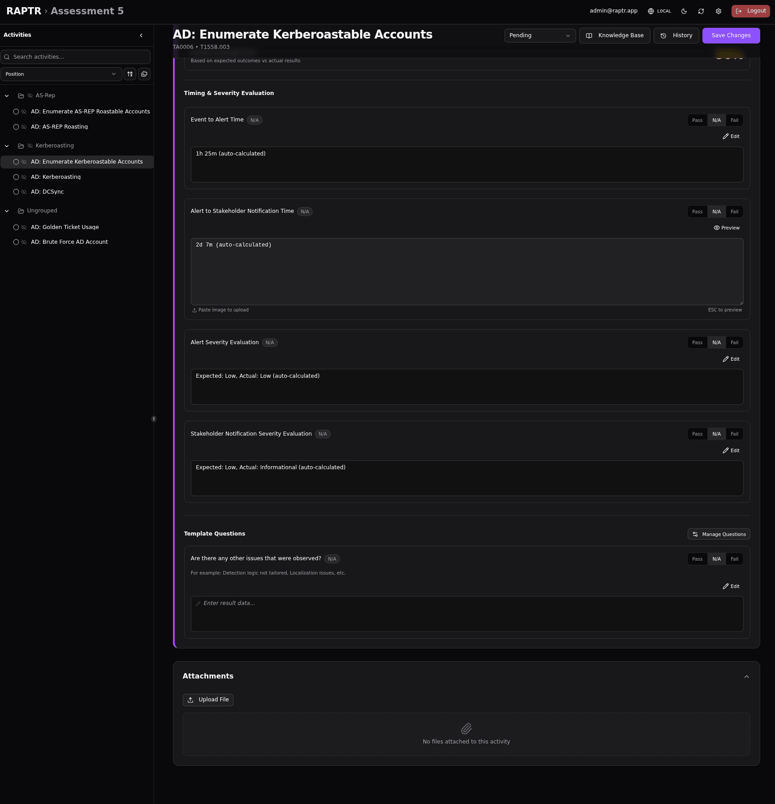
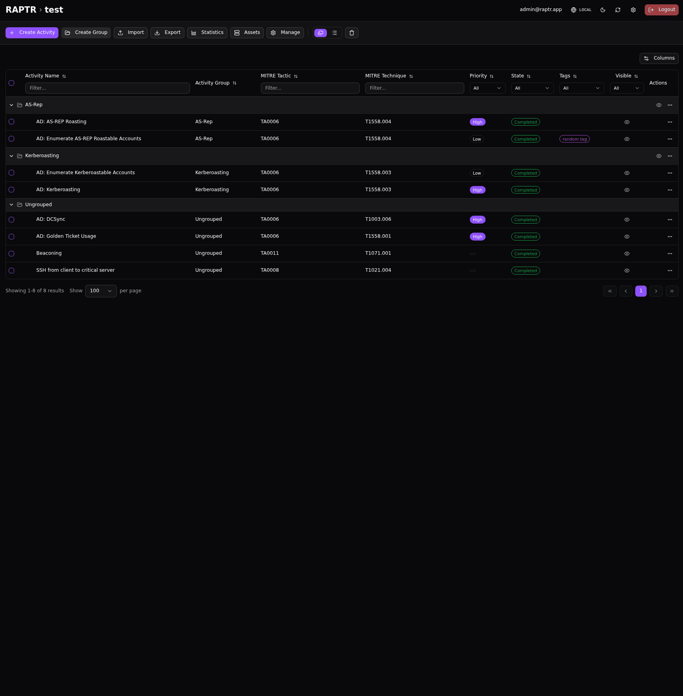

# Evaluation and Reporting

After activities are executed and reviewed, RAPTR evaluates detection performance and provides tools to analyze results and generate reports.

## Static Evaluation Questions

Each activity is evaluated by a set of static evaluation questions. These are comparing **expected outcomes** (set by the Red Team) against **actual results** (recorded by the Blue Team).

### Evaluation Results

For each detection category, the evaluation automatically produces one of three results:

| Result | Meaning |
|--------|---------|
| **Pass** | The expected outcome was met (e.g., logging was expected and the activity was logged) |
| **Fail** | The expected outcome was not met (e.g., an alert was expected but none was generated) |
| **N/A** | The outcome was not expected, so it is not evaluated |

The four standard evaluation categories are:

1. **Logged**: Was the activity captured in logs?
2. **Prevented**: Was the activity blocked by a security control?
3. **Alerted**: Did the activity trigger a security alert?
4. **Stakeholder Notified**: Was a stakeholder notification generated?

### Coverage Score

The **coverage score** is a percentage representing how many expected checks passed:

```
Coverage Score = (Passed Checks / Total Expected Checks) x 100
```

For example, if Red Team expected logging, prevention, and alerting (3 checks), and only logging and alerting were confirmed (2 passed), the coverage score is 67%.

### Timing Evaluations

The static evaluation also tracks timing metrics:

- **Event-to-Alert time**: How long between the activity execution (start time) and the first alert
- **Alert-to-Stakeholder time**: How long between the alert time and the stakeholder notification

These fields are auto-calculated, but the evaluation result must be manually set. The following options exist `pass`, `fail`, and `N/A`. By default the `N/A` state is choosen.

### Severity Evaluations

The system also compares expected vs. actual severity levels for alerts and stakeholder notifications, helping identify cases where severity was over- or under-rated. 

- **Alert vs expected severity**: The expected severity of the alert vs the actual severity of the alert
- **Stakeholder notification vs expected severity**: The expected severity of the stakeholder notification vs the actual severity of the stakeholder notification

These fields are auto-calculated, but the evaluation result must be manually set. The following options exist `pass`, `fail`, and `N/A`. By default the `N/A` state is choosen.

??? bug "Only one expected severity"
    Currently there is only one expected severity for alerts and stakeholder notification. The assumption is that both notifications should have the same severity level.

## Dynamic Evaluation Questions

Beyond the static evaluation questions, assessments can be configured with [evaluation templates](templates.md#evaluation-template) that add custom questions to each activity's evaluation. Each dynamic question has:

- The evaluation criteria (the question itself)
- A data field for the answer
- A `pass`, `fail` or `N/A` result

This allows organizations to evaluate activities against their own specific criteria (e.g., "Was the alert triaged within SLA?", "Was the correct runbook followed?").

??? abstract "Add and order default evaluation templates"
    [](../assets/eval-add-templates.gif){:target="_blank"}

??? bug "Changing default evaluation templates"
    Changing the default evaluation templates does not affect existing activities. It only affects new activities created after the change.

## Working with Evaluation Questions

Each evaluation question which cannot be answered automatically must be manually evaluated. The following options exist `pass`, `fail`, and `N/A`. By default the `N/A` state is choosen.

??? abstract "Working with evaluation questions"
    [](../assets/eval-questions.gif){:target="_blank"}

??? abstract "Working with dynamic evaluation questions"
    [](../assets/eval-dynamic-questions.gif){:target="_blank"}

??? bug "Auto-calculated fields"
    The timing and severity static evaluation questions text are auto-calculated. Nevertheless these fields support [Markdown](activities.md#markdown-fields). You can overwrite the fields. As long as the field ends in `(auto-calculated)` the field will be re-calculated on changes.

??? abstract "Working with auto-calculated fields"
    [](../assets/eval-auto-calculated.gif){:target="_blank"}


## Assessment Statistics

The statistics view provides a dashboard for analyzing an assessment's overall performance. Access it from the assessment toolbar.

!!! info "Only visible activities are included in the statistics."
    The statistics module is accessible by all [assessment role types](user_types.md#assessment-roles). It is important to understand that the statistics are calculated based on the [visibility](visibility.md) of the activities at the time of access. [Soft deleted](deletion.md#soft-delete) activities are not included in the statistics.

??? abstract "Assessment statistics"
    [](../assets/assessment-statistics.gif){:target="_blank"}

### State Distribution

A doughnut chart showing how activities are distributed across workflow states (Pending, In Progress, Completed, etc.). This gives a quick overview of assessment progress.

### Coverage Score Overview

A large metric showing the **average coverage score** across all evaluated activities, with a breakdown by priority level (Critical, High, Medium, Low). This highlights whether high-priority activities have better or worse detection coverage.

!!! info "This chart only includes activities in the 'Completed' state."

### Priority Breakdown

A horizontal bar chart showing the count of activities per priority level, giving insight into the assessment's focus areas.

!!! info "This chart only includes activities in the 'Completed' state."

### MITRE ATT&CK Heatmap

An interactive matrix visualization mapping coverage scores to MITRE ATT&CK techniques. The score is aggregated based on MITRE ATT&CK tactic and technique. Each cell is then assigned a color gradient based on the aggregated percentage, providing a visual representation of the detection capabilities. This shows at a glance which techniques are well-detected and which have gaps, organized by tactic.

!!! info "This chart only includes activities in the 'Completed' state."

??? tip "MITRE ATT&CK Navigator export"
    Use the MITRE ATT&CK Navigator export functions to generate a JSON file which can be imported in the [MITRE ATT&CK Navigator](https://mitre-attack.github.io/attack-navigator/).

### Tactic Radar Charts

Radar charts that visualize detection performance per MITRE tactic, with overlays for:

- Expected vs. actual logging
- Prevention effectiveness
- Alert generation
- Stakeholder notification

Additional per-tactic radar charts break down performance at the technique level.

!!! info "These charts only include activities in the 'Completed' state."

### Mean Time Metrics

Stacked bar charts showing:

- **Mean Time to Detect (MTTD)**: Average time from activity execution to first detection, grouped by priority
- **Mean Time to Notify Stakeholder**: Average time from alert to stakeholder notification, grouped by priority

!!! info "This chart only includes activities in the 'Completed' state."

### Alert Severity Accuracy

A comparison of expected vs. actual alert severity distribution across all activities, showing how accurately the security stack classifies threat severity.

!!! info "This chart only includes activities in the 'Completed' state."

## Generating Reports

RAPTR can generate reports from assessment data using Jinja2 based [report templates](templates.md#report-template).

### JSON Export

You can download a JSON export which includes all data from the assessment. 

!!! warning "Flattened Export"
    The JSON structure is a "flattened" export. This means you lose relationship mappings between entities. For example, assets are just listed, and you lose the information about which one was which originally.

The export file structure contains two main sections:

- **`grouped`**: Contains the data grouped logically.
- **`flat`**: Contains a flattened list of the data. During the export process, you can choose which sorting should be applied to this flat portion.

??? abstract "JSON Export"
    [](../assets/eval-json-export.gif){:target="_blank"}

### Generating a Report

You can generate a report from an assessment using a Jinja2 based [report template](templates.md#report-template).
The same JSON export is used during the report building as in the [JSON export](evaluation.md#json-export).

This means that the report template can be structured on **grouped** or **flat** basis, depending on the configuration of the template.

??? abstract "Generating a Report"
    [](../assets/eval-generate-report.gif){:target="_blank"}

### MITRE Navigator Layer

Export a MITRE ATT&CK Navigator layer file that can be loaded into the [ATT&CK Navigator](https://mitre-attack.github.io/attack-navigator/) for interactive visualization.

??? abstract "MITRE Navigator Layer"
    [](../assets/eval-mitre-navigator.gif){:target="_blank"}

### Assessment Export

See [Exporting an Assessment](assessments.md#exporting-an-assessment).