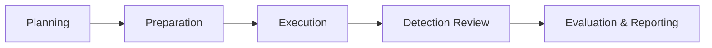
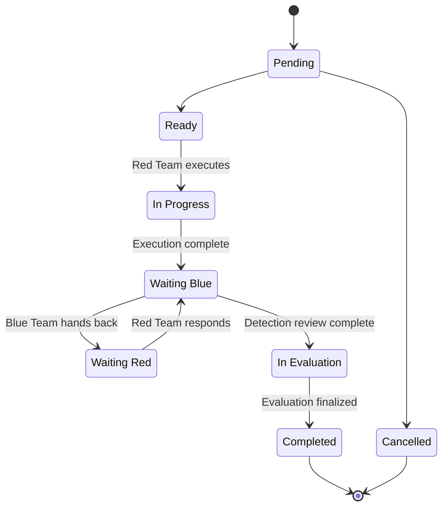

# Getting Started

This page walks you through the typical end-to-end workflow of a RAPTR assessment — from initial planning to final reporting.

!!! info "Looking for deployment instructions?"
    For instructions on how to deploy and configure RAPTR, see the [Admin Guide](../admin-guide/index.md).

## Assessment Lifecycle

A typical assessment follows five phases:

---

## Phase 1: Planning

The assessment begins with the Red Team (or an Admin) setting up the engagement in RAPTR.

1. **Create the assessment** — An Admin [creates a new assessment](assessments.md#creating-an-assessment) with a name, description, and assessment type (Purple Team or Red Team).

2. **Assign users** — The Admin [configures the ACL](assessments.md#managing-access-control), granting team members their [assessment roles](user_types.md#assessment-roles) (Red, Blue, or Spectator).

3. **Assign default dynamic evaluation questions** — The Admin [assigns default evaluation templates](assessments.md#default-evaluation-templates) to the assessment. These questions will be used to extend the [static evaluation questions](evaluation.md#static-evaluation-questions) for each activity.

4. **Import templates** — To save time, [import activity templates, group templates, or entire campaigns](assessments.md#importing-templates-and-campaigns) from the [template library](templates.md). This populates the assessment with pre-built activities, activity groups or whole campaigns.

5. **Define activities** — [Create additional activities](activities.md#creating-an-activity) as needed.

6. **Organize** — Group related activities into [activity groups](activities.md#activity-groups), optionally assign [tags](assets_and_tags.md#tags) for additional categorization, and set up [assets](assets_and_tags.md#assets) representing the infrastructure involved.

7. **Control visibility** — Keep activities [hidden](visibility.md) from the Blue Team during planning. Make them visible when they are ready for execution.

---

## Phase 2: Preparation

Before execution begins, the environment needs to be prepared.

### Overcoming "Requirements Hell"

A recurring challenge during Purple Team engagements is communicating the exact prerequisites for carrying out particular scenarios. Ambiguity in these prerequisites can result in delays, confusion, and conflict between teams.

RAPTR solves this by enabling Red Team operators to explicitly define [requirements](activities.md#general-information) for each activity. The requirements field can be used to specify the exact environmental preconditions necessary for execution — for example, specific user accounts, network access, disabled security controls, or pre-staged files.

This list of requirements can then be exported and handed off to the Blue Team, the IT provider, or any other accountable party, enabling them to adequately prepare the target environment.

??? tip "Example requirments export"
    Checkout the example `requirements.docx` file in the RAPTR `/templates/report` git directory.
    Use the export > report function to export the requirements for an assessment.

---

## Phase 3: Execution

The Red Team executes activities and moves them through the [activity states](#activity-states):

1. Move an activity from **Pending** to **Ready** once all requirements are confirmed
2. Move to **In Progress** when execution begins
3. Document what was done, when and where in the coresponding [activity details fields](activities.md#activity-details-section).
4. Move to **Waiting Blue** when execution is complete and the activity is ready for Blue Team review
5. Toggle the [visibility](visibility.md#toggling-visibility) of the activity (including activity group) to **Visible** to make it visible to the Blue Team

---

## Phase 4: Detection Review

The Blue Team reviews each activity and documents what they observed:

- Was the activity **logged**? When?
- Was it **prevented**? When?
- Was an **alert** generated? At what severity? When?
- Was a **stakeholder notification** created? At what severity? When?
- Which [assets](assets_and_tags.md#linking-assets-to-activities) (log sources, prevention sources, alert sources) were involved?

The Blue Team adds detection notes for each category and hands the activity back to **Waiting Red**.

Activities can move back and forth between **Waiting Blue** and **Waiting Red** as many times as needed. This allows both teams to clarify results, ask questions, and provide additional context until both sides are satisfied.

??? tip "Prevention details"
    Since the Red Team is directly confronted with any prevention mechanism, they may wish to complete the relevant details in the prevention section directly.

---

## Phase 5: Evaluation & Reporting

Once both teams have provided their input, the activity moves to **In Evaluation**. 
RAPTR has two distinct evaluation sections. A [static evaluation](evaluation.md#static-evaluation-questions) section and a [dynamic evaluation](evaluation.md#dynamic-evaluation-questions) section. 
The static evaluation section compares expected outcomes against actual results and calculates:

- **Pass/Fail/N/A** for each detection category
- A **coverage score** representing the percentage of expected checks that passed
- Timing metrics (event-to-alert, alert-to-stakeholder)
- Severity accuracy (expected vs. actual)

The dynamic evaluation section is managed through the [evaluation templates](templates.md#evaluation-template). For example you might find it usefull to have a question if there were any technical vulnerabilities discovered during the activity. Through the evaluation templates you are able to define such evaluation questions as needed.

After evaluation, activities are marked **Completed**.

Use the [assessment statistics dashboard](evaluation.md#assessment-statistics) for an overview of detection performance, including MITRE ATT&CK heatmaps, coverage breakdowns, and timing metrics. [Generate reports](evaluation.md#generating-reports) to share results with stakeholders.

---

## Activity States

Every activity in RAPTR follows a defined lifecycle. These are the available states:

| State | Icon | Badge | Description |
|-------|:----:|:-----:|------------|
| **Pending** | :lucide-circle:{ style="color: #737373" } | Pending | Created but not yet started. The Red Team reviews the plan and prepares for execution. |
| **Ready** | :lucide-circle-play:{ style="color: #14b8a6" } | Ready | Prepared and all requirements are in place. Ready to be executed. |
| **In Progress** | :lucide-circle-play:{ style="color: #f97316" } | In Progress | The Red Team is actively executing the activity. |
| **Waiting Blue** | :lucide-circle-help:{ style="color: #3b82f6" } | Waiting Blue | Execution is complete. Waiting for the Blue Team to review and document detection results. |
| **Waiting Red** | :lucide-circle-help:{ style="color: #ef4444" } | Waiting Red | The Blue Team needs more information. Handed back to the Red Team for clarification. |
| **In Evaluation** | :lucide-circle-help:{ style="color: #a855f7" } | In Evaluation | Both teams have provided their input. The activity is being evaluated against expected outcomes. |
| **Completed** | :lucide-circle-check:{ style="color: #16a34a" } | Completed | Fully resolved. Evaluation is done and no further action is needed. |
| **Cancelled** | :lucide-circle-x:{ style="color: #eab308" } | Cancelled | The activity has been cancelled and will not be executed. |

### State Diagram

### Who Can Change State?

| Role | Allowed State Changes |
|------|----------------------|
| **Admin / Red Team** | Can transition an activity to any state |
| **Blue Team** | Can only toggle between **Waiting Blue** and **Waiting Red** |
| **Spectator** | Cannot change state |
