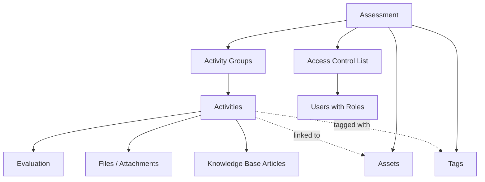

# Key Objects

This page explains the key objects in RAPTR and how they relate to each other.

## Assessment

An [**assessment**](assessments.md) is the top-level container that represents an entire security engagement. Everything else — activities, groups, assets, tags, and user access — lives within an assessment.

## Activity

An [**activity**](activities.md) is a single planned action within an assessment — typically a specific attack technique or scenario that the Red Team intends to execute. Activities are the core unit of work in RAPTR.

- Activities are mapped to [MITRE ATT&CK](https://attack.mitre.org/) tactics and techniques
- Each activity belongs to at most one [activity group](#activity-group)
- Activities move through a defined [workflow](getting_started.md#activity-states) of states from **Pending** to **Completed**
- Activities can be toggled [visible or hidden](visibility.md) to control Blue Team and Spectator access
- Activities can have [assets](#asset), [tags](#tag), [attachments](activities.md#attachments), and [knowledge base](knowledge_base.md) articles linked to them
- Each activity tracks Red Team planning (rationale and requirements), expected outcomes, actual results, and Blue Team detection notes
- Each activity tracks its own evaluation using [evaluation templates](templates.md#evaluation-template)

For details on working with activities, see [Working with Activities](activities.md).

## Activity Group

An [**activity group**](activities.md#activity-groups) is an organizational container that groups related activities together. Groups help structure an assessment logically — for example, by attack phase, scenario, or objective.

- Each activity belongs to at most one group
- Groups can be reordered within the assessment
- Activities can be reordered within their group
- Groups can be toggled [visible or hidden](visibility.md) independently of their activities
- Each assessment has a **default group** for ungrouped activities

## Asset

An [**asset**](assets_and_tags.md#assets) represents a piece of infrastructure or a system involved in the assessment. Assets have a name, an icon, and flexible **properties** (key-value pairs) that can store any relevant metadata such as IP addresses, hostnames, operating systems, or any custom fields.

## Tag

A [**tag**](assets_and_tags.md#tags) is a colored label that can be applied to activities for categorization and filtering. Tags are scoped to an assessment — each assessment has its own set of tags. Tags have a name and a color.

## How It All Fits Together

