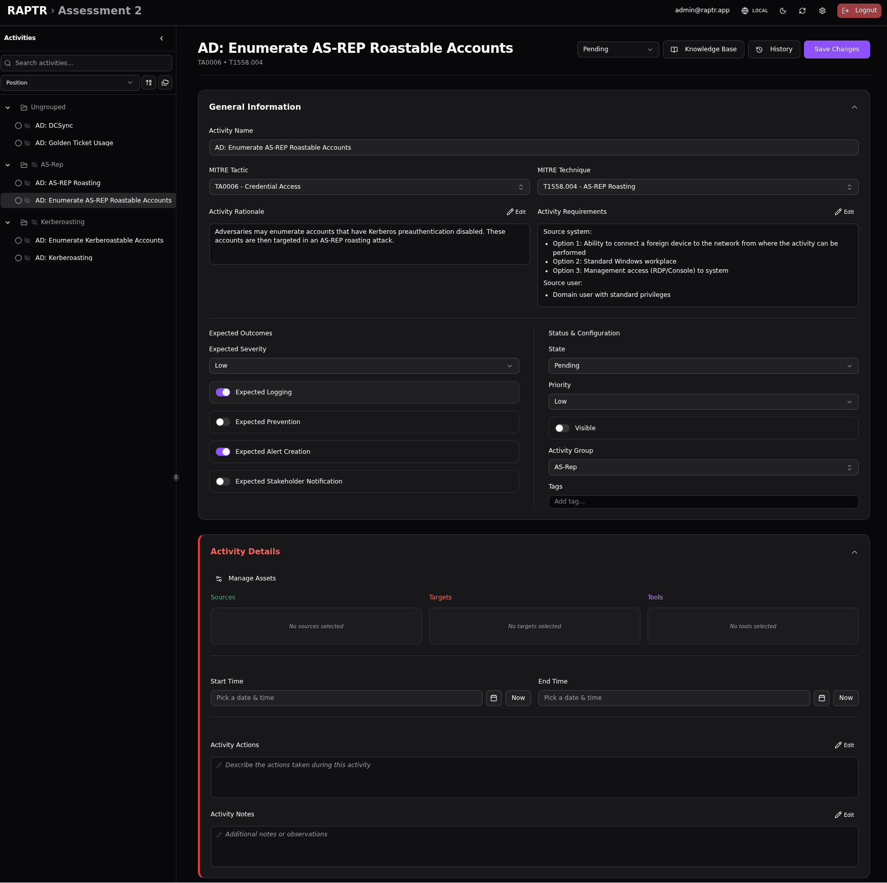

# Knowledge Base

The **knowledge base** is your organization's library of reference articles providing context for attack techniques. Knowledge base articles are intended as a **quick reference** guide for red teamers on how to carry out a specific attack.

Knowledge base articles are maintained outside of RAPTR in your organization's custom data repository and imported via [seeding](administration.md#custom-data). They cannot be created or edited from within the application.

## Article Structure

Each knowledge base article has:

- A **name** identifying the article
- A **MITRE technique ID** linking it to a specific ATT&CK technique (e.g., T1003.001)
- **Content** — structured JSON containing sections and tabs with rich text, allowing flexible organization of attack details, detection guidance, and remediation steps

## Linking Articles to Activities

Articles are linked to activities in two ways:

- **By MITRE technique**: When an activity is mapped to a MITRE technique, all knowledge base articles linked to that technique are automatically available in the activity's knowledge base section.
- **By activity template**: [Activity templates](templates.md#activity-template) can reference specific knowledge base articles by name. When imported into an assessment, these links are carried over to the created activity — allowing templates to point to articles beyond just the MITRE technique mapping.

## Variables

Code blocks in knowledge base articles are designed to contain **placeholders** in the format `{{ KEY }}` (e.g., `{{ TARGET_HOST }}`, `{{ DOMAIN }}`) that represent environment-specific values. You can import a **variables file** (JSON) to replace these placeholders with actual values for your engagement in the corresponding code blocks.

Variables are stored per assessment in your browser's session storage and applied client-side when rendering knowlege base content. To import variables:

1. Open the assessment
2. Click **Import** > **Variables** in the toolbar or click :lucide-upload: **Import Variables** in the knowledge base section
3. Upload a JSON file with key-value pairs

```json
{
  "TARGET_HOST": "dc01.corp.local",
  "DOMAIN": "corp.local",
  "ATTACKER_IP": "10.0.0.50",
  "TARGET_DOMAIN_USER": "administrator"
}
```
??? abstract "Working with the knowledge base"
    [](../assets/kb-overview.gif){:target="_blank"}

??? tip "Toggle variables"
    Use the :lucide-arrow-left-right: icon in the code block to toggle between the placeholder and the variable value.

For details on setting up the knowledge base and variable files, see the [Admin Guide](../admin-guide/index.md).
