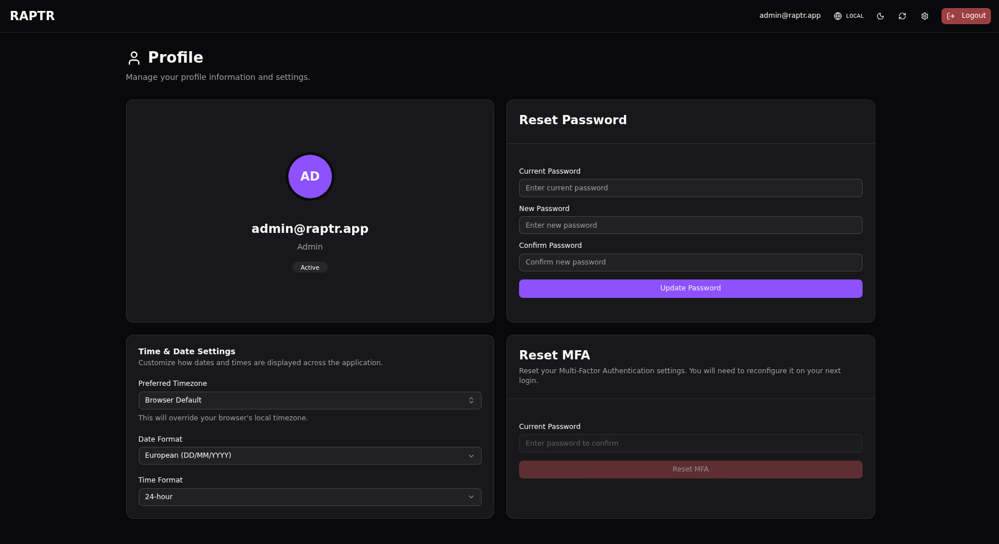
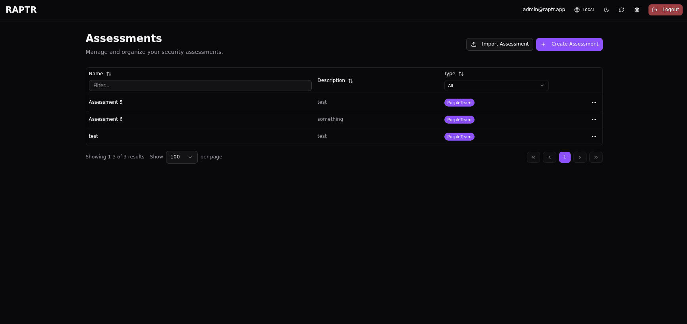
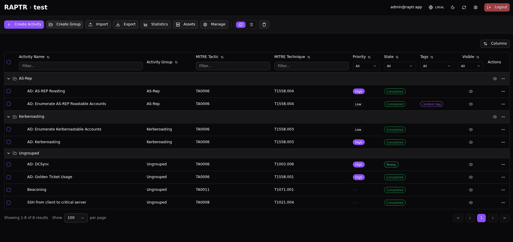

# User Preferences

Configure your personal account settings from the **Profile** `/profile` page, accessible from the :lucide-settings: navigation menu.

## Profile Information

View your account details including your email address, user ID, and system role. Your email and role are managed by an administrator.

{:target="_blank"}

## Password

Change your account password from the profile page. Enter your current password and choose a new one. Password requirements are configured by the system administrator.

??? bug "Password requirements not visible"
    Currently the password requirements are not shown to the user in the UI. You will see an error if it does not match the requirements, after submitting.

## Timezone and Date Format

Configure your preferred timezone, date and time format. These settings affect how timestamps are displayed throughout the application — activity start/end times, detection timestamps, and history entries will all be shown in your chosen timezone and format.

You can switch between UTC and your local time zone through the [top bar](#toggle-utc-and-local-time).

??? abstract "Configure date and time format"
    {:target="_blank"}

??? bug "Long render time"
    The preferred timezone dropdown renders all available time zones. This can take a few seconds.

## Multi-Factor Authentication (MFA)

RAPTR supports time-based one-time password (TOTP) multi-factor authentication for additional account security.

You can use the **Reset MFA** function to delete the current OTP secret. You will be logged out and can generate a new OTP secret on your next login.

An Administrator can also reset a users MFA. See [Administration](administration.md#reset-mfa) for more information.

??? bug "No optional MFA choice"
    The current RAPTR setup only support global MFA enforcement. Either it is required or not. There is no option to enable or allow MFA on a per user basis.

## User Interface Basics

The RAPTR interface includes a few basic controls accessible from the top bar:

### Dark and Light Mode

Toggle between dark and light themes using the theme switch icon (:lucide-sun: and :lucide-moon:) in the top navigation bar. Your preference is saved locally in your browser.

??? abstract "Dark and Light Mode"
    {:target="_blank"}

### Auto-Refresh

Some views, such as the assessments list or activity list, support auto-refreshing to easily monitor ongoing assessments without needing to manually reload the page. Look for the :lucide-refresh-cw: refresh icon in the toolbar. Depending on the view, you can click it to manually refresh the data, or toggle auto-refresh on/off according to your needs.

??? abstract "Auto-Refresh"
    {:target="_blank"}

??? bug "No WebSocket Support"
    RAPTR does currently not support WebSockets. Thus the auto-refresh functionality is a polling mechanism.

### Toggle UTC and Local Time

Toggle between UTC and local time using the :lucide-globe: icon in the top navigation bar. Your preference is saved locally in your browser. All times in RAPTR should display according to this setting.
You can overwride your browser local time zone in the [profile settings](#timezone-and-date-format).

??? abstract "Toggle between UTC and local time"
    {:target="_blank"}

### Logging Out

To end your session securely, click on your user profile icon in the navigation menu and select **Logout**.

!!! tip "Access token invalidation"
    The logout function invalidates your access token even if it is still valid.