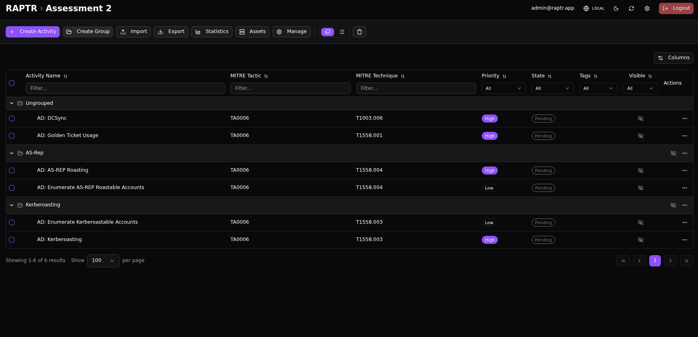

# Visibility

Activities and activity groups have a **visibility** flag that controls whether they are shown to Blue Team and Spectator users.

- When an item is :lucide-eye-off: **hidden**, only Admins and Red Team members can see it
- When it is :lucide-eye: **visible**, all users with access to the assessment can see it

This is useful during the planning phase — the Red Team can prepare activities without revealing them to the Blue Team until they are ready for execution.

## Inherited Visibility

The visibility of an activity is inherited from its parent activity group. If an activity group is hidden, all activities within that group are also hidden, regardless of their individual visibility settings.

??? bug "Inherited Visibility"
    The UI does currently not calculate the inherited visibility. The visibility icon shown on the activity level indicate only if the current activity is :lucide-eye-off: hidden or :lucide-eye: visible. It does not indicate if the activity is hidden or visible due to the visibility of its parent activity group.

## Toggling Visibility

Visibility can be changed in several ways:

- Toggle visiblity of activities and activity groups from the [activity table](activities.md#activity-views)
- Toggle visibility of activities in bulk from the [activity table](activities.md#activity-views)
- Toggle visiblity of activities and activity groups from the [coresponding form](activities.md#general-information)

??? abstract "Toggle visibility in table view"
    {:target="_blank"}

??? abstract "Toggle visibility in bulk"
    {:target="_blank"}

??? abstract "Toggle visibility in form"
    {:target="_blank"}

